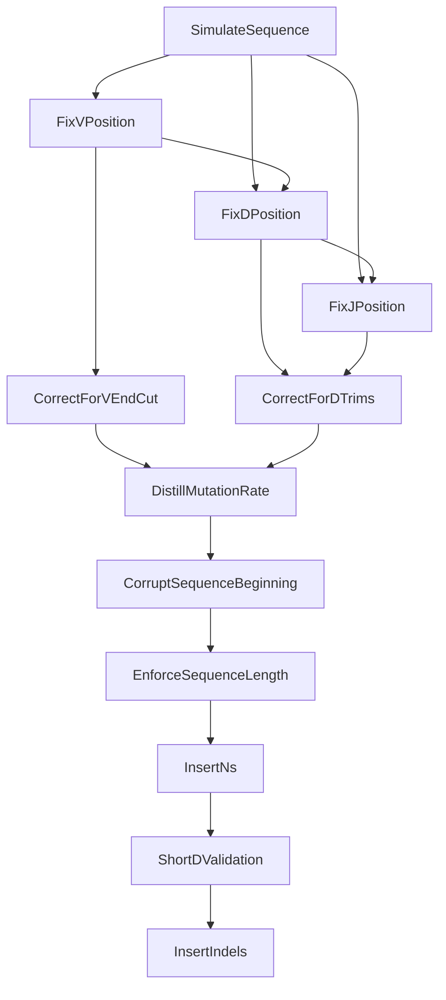

# Pipeline Operations & Step Order

A GenAIRR pipeline is an ordered list of steps that transform an empty `SimulationContainer` into a fully annotated simulated sequence. The order matters — each step depends on data written by earlier steps, and reordering can produce incorrect results.

This page explains what each category of steps does, why the default order is what it is, and what happens if you change it.

---

## The Six Step Categories

Every built-in step falls into one of six categories:

| Category | Steps | Purpose |
|----------|-------|---------|
| **1. Generation** | `SimulateSequence` | Creates the initial sequence from germline segments with mutations |
| **2. Position Correction** | `FixV/D/JPositionAfterTrimmingIndexAmbiguity` | Resolves boundary ambiguities caused by trimming |
| **3. Biological Correction** | `CorrectForVEndCut`, `CorrectForDTrims` | Identifies equivalent alleles after trimming |
| **4. Measurement** | `DistillMutationRate` | Records the mutation rate before artifacts distort it |
| **5. Artifact Simulation** | `CorruptSequenceBeginning`, `EnforceSequenceLength`, `InsertNs`, `InsertIndels` | Simulates real-world sequencing imperfections |
| **6. Validation** | `ShortDValidation`, `FilterTCRDJAmbiguities` | Flags edge cases in the final output |

---

## The Recommended Order

Here is the default step order with a rationale for each position:

### 1. SimulateSequence

**What:** Selects V, D, J alleles → applies trimming → adds NP junctions → applies mutations → validates productivity.

**Why first:** Everything else operates on the sequence this step creates. No other step can run without it.

### 2–4. Position Correction (FixV → FixD → FixJ)

**What:** Each step examines the junction (NP) region adjacent to its segment and checks whether the random nucleotides happen to match the sequence that was trimmed away. If they do, the step expands the segment boundary to absorb those matching bases.

**Why here:** These steps need the original, unmodified sequence and position data from `SimulateSequence`. If artifacts (corruption, indels) modify the sequence first, the overlap detection would compare against corrupted data and produce wrong boundaries.

**Why V → D → J order:** D ambiguity correction reads `v_sequence_end` (set by the V step), and J correction reads `d_sequence_end` (set by the D step). They must run in this order.

!!! info "Light chains"
    Light chains have no D segment. Omit `FixDPositionAfterTrimmingIndexAmbiguity` for kappa/lambda chains.

### 5–6. Biological Correction (CorrectForVEndCut → CorrectForDTrims)

**What:** After trimming, multiple different alleles can produce identical remaining sequences. These steps look up which alleles become indistinguishable and add all possibilities to the `v_call` / `d_call` list.

**Why here:** They depend on the final trim amounts, which may have been adjusted by the position correction steps. They must run after position correction but before artifacts alter the sequence.

### 7. DistillMutationRate

**What:** Removes mutations that fell in NP regions (non-germline), then recalculates the mutation rate based only on germline-derived positions.

**Why here:** This must happen **before** artifact steps. Corruption, N-insertion, and indels all modify the sequence in ways that are not biological mutations. If `DistillMutationRate` ran after those steps, the reported mutation rate would be inflated or inaccurate.

!!! warning "Critical ordering constraint"
    Placing `DistillMutationRate` after `CorruptSequenceBeginning` or `InsertNs` will produce incorrect mutation rates. Always place it before any artifact step.

### 8. CorruptSequenceBeginning

**What:** Simulates 5' end degradation by adding random bases, removing bases, or both from the sequence start. Shifts all position annotations accordingly. Adds equivalent V alleles for any newly-trimmed V region.

**Why here:** This is the first artifact step. It modifies the sequence and all positions, so it must come after all correction/measurement steps. It should come before `EnforceSequenceLength` because corruption can add bases that push the sequence over the length limit.

### 9. EnforceSequenceLength

**What:** If the sequence exceeds `max_length`, trims from the 5' end to fit the read-length limit.

**Why after corruption:** Corruption can add bases to the 5' end, making the sequence longer. Length enforcement cleans that up. If it ran before corruption, the corruption could push the sequence over the limit again.

### 10. InsertNs

**What:** Replaces random positions with 'N' to simulate low-quality base calls. Looks up which V alleles become indistinguishable when discriminating positions are obscured by Ns.

**Why here:** Runs after the sequence has its final structure (post-corruption, post-length-enforcement) so that N positions reflect the actual output sequence.

### 11. ShortDValidation

**What:** Checks if the D segment is shorter than a threshold (default: 5 bp). If so, replaces `d_call` with `["Short-D"]` to flag unreliable D assignment.

**Why here:** Must run after all position adjustments and corrections are complete, since those steps may change D boundaries.

### 12. InsertIndels

**What:** Introduces random insertions and deletions at valid positions. Shifts all annotations for each indel. Recalculates productivity (indels can introduce frameshifts).

**Why last:** Indels change sequence length and shift every downstream position. Running them last minimizes cascading position updates. No subsequent step needs to track shifted positions.

---

## What Breaks If You Reorder

| Wrong Order | Consequence |
|-------------|-------------|
| `InsertIndels` before `FixVPosition` | Position correction compares against a sequence with extra/missing bases — boundaries will be wrong |
| `DistillMutationRate` after `InsertNs` | N-replacement positions are counted as mutations, inflating the rate |
| `DistillMutationRate` after `CorruptSequenceBeginning` | Removed bases lose their mutation tracking; added bases dilute the rate |
| `EnforceSequenceLength` before `CorruptSequenceBeginning` | Corruption can add bases, exceeding the length limit with no enforcement after |
| `CorrectForVEndCut` before `FixVPosition` | Trim amount hasn't been adjusted yet, so the similarity map lookup uses wrong values |
| `ShortDValidation` before `CorrectForDTrims` | D boundaries haven't been finalized, may flag a D that would have been expanded |

---

## Chain-Specific Step Selection

Not all steps apply to all chain types:

| Step | Heavy (IGH) | Kappa (IGK) | Lambda (IGL) | TCR Beta (TRB) |
|------|:-----------:|:-----------:|:------------:|:--------------:|
| SimulateSequence | ✓ | ✓ | ✓ | ✓ |
| FixVPosition | ✓ | ✓ | ✓ | ✓ |
| FixDPosition | ✓ | — | — | ✓ |
| FixJPosition | ✓ | ✓ | ✓ | ✓ |
| CorrectForVEndCut | ✓ | ✓ | ✓ | ✓ |
| CorrectForDTrims | ✓ | — | — | ✓ |
| DistillMutationRate | ✓ | ✓ | ✓ | ✓ |
| CorruptSequenceBeginning | ✓ | ✓ | ✓ | ✓ |
| EnforceSequenceLength | ✓ | ✓ | ✓ | ✓ |
| InsertNs | ✓ | ✓ | ✓ | ✓ |
| ShortDValidation | ✓ | — | — | ✓ |
| InsertIndels | ✓ | ✓ | ✓ | ✓ |
| FilterTCRDJAmbiguities | — | — | — | ✓ |

!!! tip "Rule of thumb"
    If a step name contains "D" (FixD, CorrectForDTrims, ShortDValidation), include it only for chains that have a D segment: heavy chain and TCR beta.

---

## Building Pipelines at Different Complexity Levels

### Minimal (testing)

```python
pipeline = Pipeline(
    config=HUMAN_IGH_OGRDB,
    steps=[
        steps.SimulateSequence(S5F(min_mutation_rate=0.01, max_mutation_rate=0.05), productive=True),
    ]
)
```

Produces a mutated sequence with basic annotations. No ambiguity resolution, no artifacts.

### Research (clean data)

```python
pipeline = Pipeline(
    config=HUMAN_IGH_OGRDB,
    steps=[
        steps.SimulateSequence(S5F(min_mutation_rate=0.01, max_mutation_rate=0.05), productive=True),
        steps.FixVPositionAfterTrimmingIndexAmbiguity(),
        steps.FixDPositionAfterTrimmingIndexAmbiguity(),
        steps.FixJPositionAfterTrimmingIndexAmbiguity(),
        steps.CorrectForVEndCut(),
        steps.CorrectForDTrims(),
        steps.DistillMutationRate(),
    ]
)
```

Clean sequences with accurate boundaries and allele calls. Good for algorithm development.

### Production (realistic data)

```python
pipeline = Pipeline(
    config=HUMAN_IGH_OGRDB,
    steps=[
        steps.SimulateSequence(S5F(min_mutation_rate=0.01, max_mutation_rate=0.05), productive=True),
        steps.FixVPositionAfterTrimmingIndexAmbiguity(),
        steps.FixDPositionAfterTrimmingIndexAmbiguity(),
        steps.FixJPositionAfterTrimmingIndexAmbiguity(),
        steps.CorrectForVEndCut(),
        steps.CorrectForDTrims(),
        steps.DistillMutationRate(),
        steps.CorruptSequenceBeginning(),
        steps.EnforceSequenceLength(),
        steps.InsertNs(),
        steps.ShortDValidation(),
        steps.InsertIndels(),
    ]
)
```

Full simulation including sequencing artifacts. Use for benchmarking tools against realistic data.

---

## Dependency Diagram



Arrows indicate "must come before." Steps without arrows between them could theoretically be reordered, but the default order is recommended for consistency.
