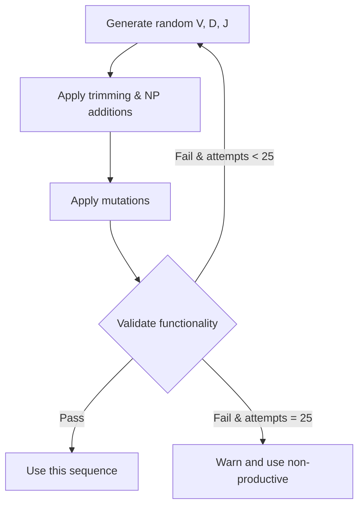

# Understanding Productive Sequences

In the immune system, V(D)J recombination is an inherently imprecise process. Random segment selection, exonuclease trimming, and non-templated nucleotide addition mean that roughly **two-thirds of all rearrangements produce non-functional sequences** — out of frame, containing stop codons, or missing critical structural residues.

GenAIRR models this biological reality and gives you control over whether to generate only functional (productive) sequences or to include non-productive ones.

---

## The Biology: What Makes a Sequence Productive?

A productive immunoglobulin sequence must satisfy four conditions simultaneously:

### 1. Reading Frame Preservation

The V, D (if present), and J segments must join such that the final sequence maintains a continuous open reading frame. Since each codon is 3 nucleotides, the junction boundaries and the total junction length must all be divisible by 3.

If trimming and N-addition shift the reading frame, the entire downstream sequence translates incorrectly — producing a non-functional protein.

### 2. No Premature Stop Codons

The three stop codons — **TAG**, **TAA**, and **TGA** — terminate translation. If any appear in the reading frame of the rearranged sequence, the resulting protein is truncated and non-functional.

Stop codons can arise from:

- Frameshift due to improper junction length
- Unlucky N-nucleotide additions that create stop codons at junctions
- Somatic hypermutation introducing stop codons into coding regions

### 3. Conserved Cysteine at the V-J Junction Start (CDR3)

The second cysteine residue at IMGT position 104 (encoded by **TGT** or **TGC**) marks the beginning of the CDR3 region. This cysteine forms a disulfide bond essential for immunoglobulin folding. If it is destroyed by trimming or mutation, the antibody cannot fold properly.

### 4. Conserved Tryptophan or Phenylalanine at the J End (CDR3)

The conserved **Trp** (W, encoded by TGG) or **Phe** (F, encoded by TTT/TTC) at the J-side of the CDR3 marks the boundary between CDR3 and framework region 4. This anchor residue is required for proper chain assembly.

!!! note "Why both W and F?"
    Heavy chain J segments typically use Trp (W), while some light chain and TCR J segments use Phe (F). GenAIRR accepts either as valid.

---

## GenAIRR's Validation System

GenAIRR implements these biological rules through a **FunctionalityValidator** that applies five sequential validation rules:

| # | Rule | What it checks | Failure consequence |
|---|------|---------------|---------------------|
| 1 | **StopCodonRule** | Scans the entire sequence for TAG, TAA, TGA in the reading frame | Fatal — stops all further validation |
| 2 | **FrameAlignmentRule** | Junction start, end, and length are all divisible by 3 | Marks `vj_in_frame = False` |
| 3 | **JunctionTranslatableRule** | Junction region can be translated to amino acids | Fatal — subsequent rules require translation |
| 4 | **ConservedCysteineRule** | First amino acid of junction is Cysteine (C) | Marks sequence as non-functional |
| 5 | **ConservedAnchorRule** | Last amino acid of junction is Trp (W) or Phe (F) | Marks sequence as non-functional |

A sequence is considered **productive** only if all five rules pass.

The validator sets these fields on the sequence object:

- `functional` — `True` if all rules pass
- `stop_codon` — `True` if a stop codon was found
- `vj_in_frame` — `True` if reading frame and stop codon rules both pass
- `junction_aa` — The translated junction amino acid sequence (if translatable)
- `note` — Description of the failure reason (if any)

---

## Two Levels of Productivity Control

GenAIRR provides **two independent** `productive` flags that operate at different stages:

### Level 1: Sequence Generation (`SimulateSequence`)

```python
steps.SimulateSequence(
    S5F(min_mutation_rate=0.02, max_mutation_rate=0.08),
    productive=True  # ← This flag
)
```

**What it does:** After generating a random V(D)J rearrangement and applying mutations, GenAIRR runs the full validation. If the sequence is non-functional and `productive=True`, it **discards the sequence and tries again** — up to 25 attempts.



!!! warning "The 25-attempt limit"
    If all 25 attempts fail to produce a productive sequence, GenAIRR issues a warning but proceeds with the last non-productive sequence. This is rare with typical mutation rates but can happen at very high rates (>20%) or with specific allele constraints.

### Level 2: Mutation Safety (`MutationModel`)

```python
S5F(min_mutation_rate=0.02, max_mutation_rate=0.08, productive=True)  # ← This flag
```

**What it does:** During mutation application, each candidate mutation is checked **before** it is applied:

1. **Stop codon check** — Would this substitution create a stop codon in the reading frame? If yes, reject.
2. **Anchor check** — Would this substitution destroy the conserved Cys (V anchor) or Trp/Phe (J anchor)? If yes, reject.

For each position, GenAIRR tries up to **100 alternative mutations** before giving up on that position.

!!! tip "When to use which flag"
    - **`SimulateSequence(productive=True)`** — Use this when you want only productive sequences in your output. This is the most common setting.
    - **`S5F(productive=True)`** — Use this when you want mutations to preserve functionality. Useful at high mutation rates where unrestricted mutation would frequently destroy the sequence.
    - **Both together** — Maximum protection. The sequence starts productive, and mutations are constrained to keep it productive.
    - **Neither** — Generates a natural mix of ~1/3 productive + ~2/3 non-productive sequences, with unrestricted mutation.

---

## How the Mutation Models Handle Productivity

### S5F Model

The S5F model's productive mode works as follows for each candidate mutation:

1. Compute the 5-mer context around the target position
2. Get the context-dependent substitution probabilities
3. **Filter out** bases that would create stop codons (using the reading frame)
4. **Filter out** mutations that would destroy anchor codons
5. Sample from the remaining valid substitutions
6. **Post-check**: Verify no stop codon was introduced (defensive check)

### Uniform Model

The Uniform model's productive mode:

1. Select a random position
2. Select a random replacement base
3. Check if it would create a stop codon → if yes, retry (up to 100 times)
4. Check if it would destroy an anchor → if yes, retry
5. Apply if valid; skip position if all attempts fail

---

## Practical Guidance

### Benchmarking alignment tools
Use `productive=True` for `SimulateSequence` to match real-world data where most analyzed sequences are functional.

### Studying non-productive rearrangements
Set `productive=False` on both flags. The output will include sequences with stop codons, frameshifts, and missing anchors — reflecting the full biological diversity.

### High mutation rate simulations
When using mutation rates above 10%, consider setting `S5F(productive=True)` to prevent mutations from introducing stop codons. Without this, high mutation rates frequently destroy sequence functionality.

### Examining the productivity fields
After simulation, check these fields in the output:

```python
result = pipeline.execute()
data = result.get_dict()

print(data['productive'])    # True/False
print(data['stop_codon'])    # True/False
print(data['vj_in_frame'])   # True/False
print(data['note'])          # Failure reason or empty string
```
