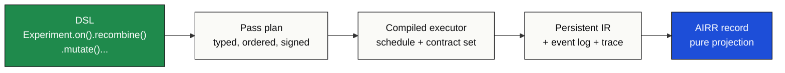
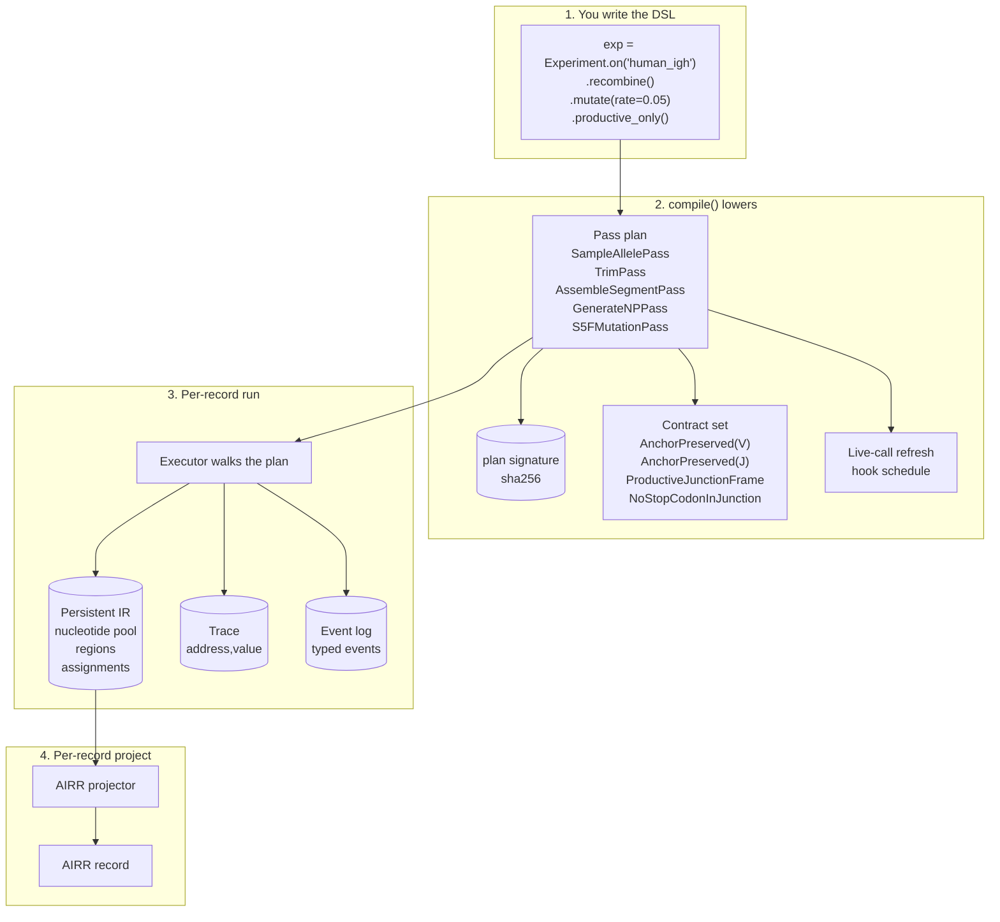
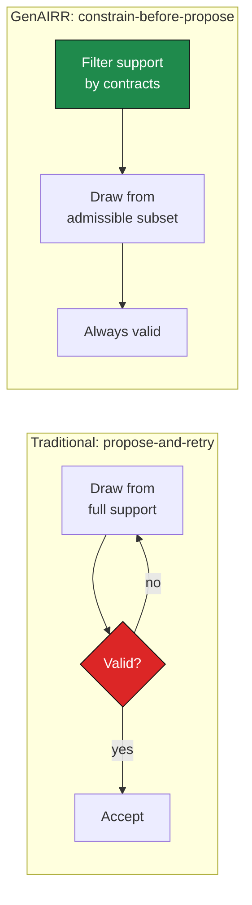
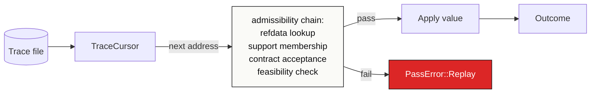
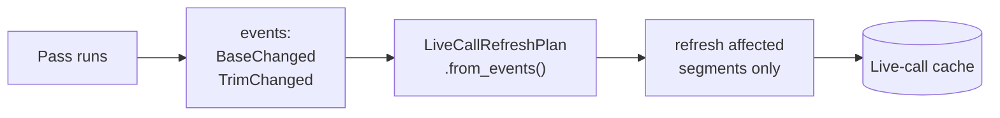
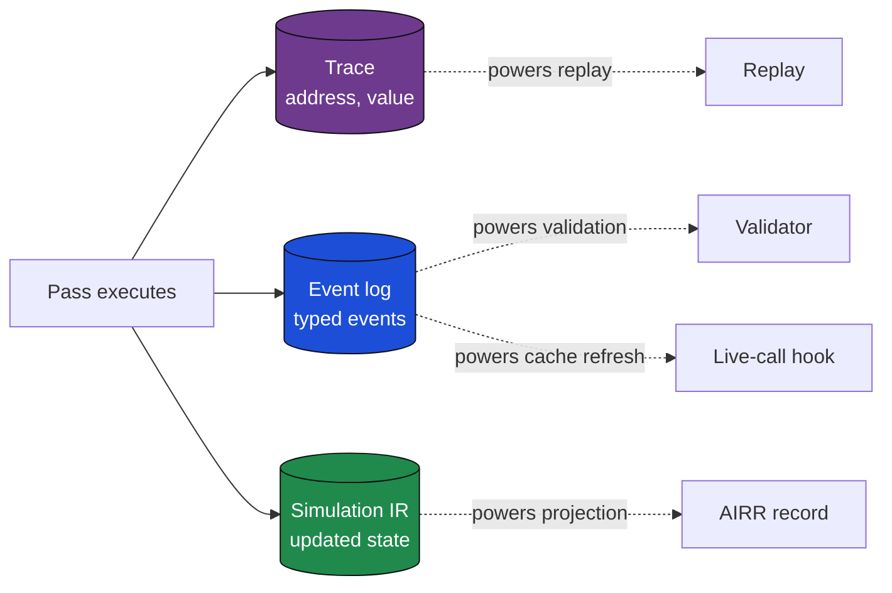
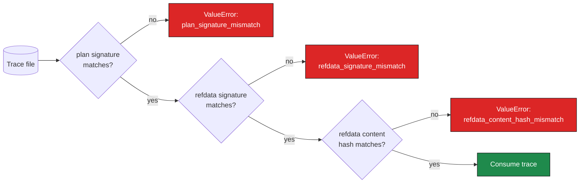
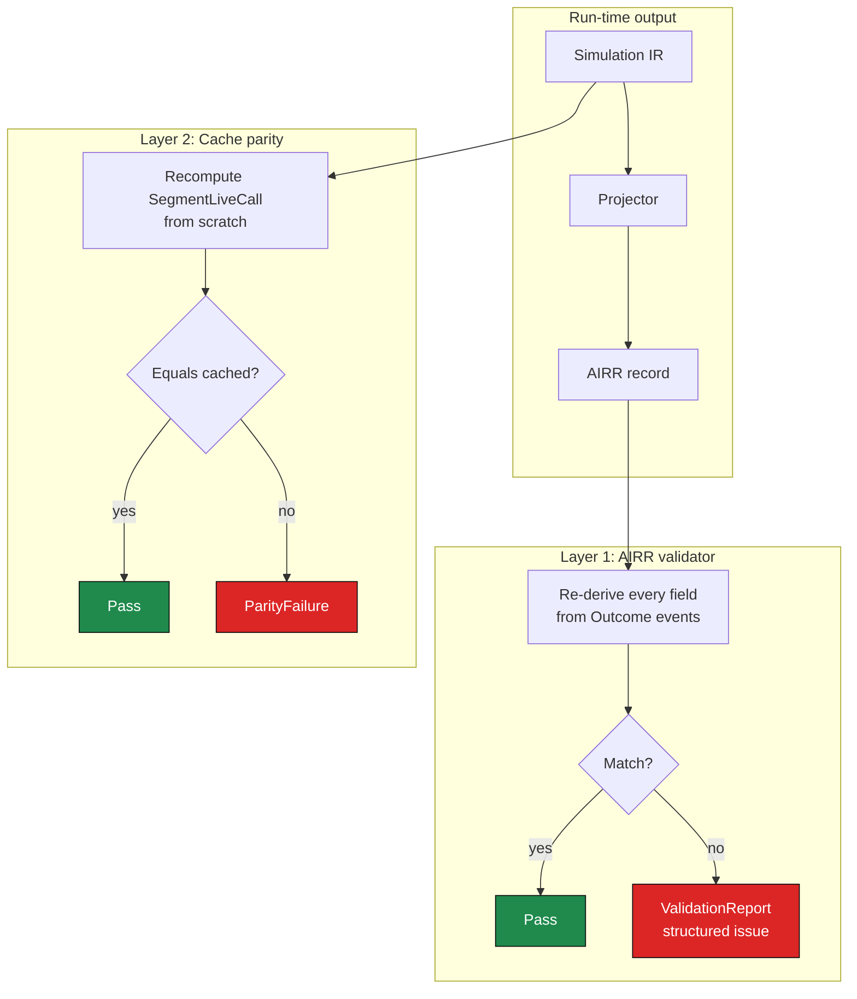
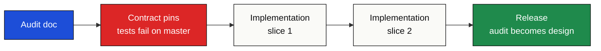

# Architecture

A deep look at how the GenAIRR engine actually
produces records. This page explains the lowering pipeline,
the seven invariants the kernel guarantees, the novel
constrain-before-propose sampling strategy, the dual stream
(trace + events) per pass, and the two-layer integrity model.
For the canonical contributor-facing reference, see the audit
corpus at <code>audit-docs/</code>.

## The mental model in one diagram

A simulation goes through four distinct stages. The user touches
the first one; the engine handles the rest.

The transitions matter as much as the boxes:

| Transition | What happens |
|---|---|
| **DSL → Pass plan** | `Experiment.compile()` lowers the chained method calls into a typed, ordered, signed pass plan. The plan is the engine's actual input; the `Experiment` object is just a builder. |
| **Pass plan → Executor** | Compile analyses the plan, resolves the contract set, schedules live-call refresh hooks, and stamps the plan signature. |
| **Executor → IR** | Each pass runs against the persistent IR. Every random draw lands at a typed address; every state change emits a typed event. The IR is *the* source of truth. |
| **IR → AIRR record** | A pure projection layer reads the final IR pool and produces the AIRR record. The projection has no state of its own. Re-running it on the same IR is byte-identical. |

The boundaries between stages are why GenAIRR can offer features
other simulators can't: byte-stable replay, structured validation,
post-hoc revision, audit-first development.

## Who reads this section

- **Contributors** adding new passes, contracts, AIRR fields, or
  cartridge planes.
- **Advanced users** debugging an unexpected output or reviewing
  a published GenAIRR dataset against its source.
- **Maintainers** auditing one mechanism's drift across a release,
  or scoping a refactor's blast radius before touching kernel code.

If you're learning the simulator for the first time, the
[Getting Started](../getting-started/index.md) and
[Core Concepts](../concepts/index.md) tracks are the right
starting points. Come back here when something below those
surprises you.

## How the DSL becomes a simulation

The DSL is not the engine. It's a *builder* for a typed pass
plan. The compilation step is where novel correctness guarantees
are established.

A few facts to call out:

- **The pass plan is signed before the first record runs.** That
  signature gets folded into every trace; replay is gated on it.
  Two runs of the same DSL produce the same plan signature, no
  matter the machine.
- **The contract set is resolved at compile time, not per draw.**
  `productive_only()` doesn't fire at every draw point and check
  things; four predicates get registered, and the relevant
  sampling sites consult them via a typed `admits_typed` trait.
  This is *constrain before propose*, covered in detail below.
- **The IR is persistent.** Each pass writes to it through an
  event-emitting builder, never directly. The event stream
  exists because validators and the live-call refresh hook need
  to know what changed.
- **The AIRR record is a projection.** It's derived from the
  final IR pool by a pure function. The record has no state of
  its own; the IR does.

## The seven engine invariants

The kernel's correctness rests on seven layered invariants. Each
has a canonical Rust type and a contract test that proves it. The
canonical write-up is at
[`audit-docs/engine_architecture.md`](https://github.com/MuteJester/GenAIRR/blob/master/audit-docs/engine_architecture.md);
the short version follows.

### 1. Contracts constrain *support* before proposals

This is the most distinctive design choice. Most simulators
build a sequence and check it afterwards; if broken, they
discard and resample. That's slow, statistically biased toward
weakly-constrained edges of the distribution, and offers no way
to reason about which draws are admissible.

GenAIRR inverts the order:

At every contract-aware sampling site, the candidate distribution
is filtered by the active contract set's `admits_typed` predicate
before any draw happens. A draw that returns a value is admissible
by construction. There is no rejection loop.

When the admissible set is *empty* (the constraint can't be
satisfied at this site), behaviour depends on the mode:

- **Permissive** (default): fall back to an explicit *sentinel*,
  such as `0` for a trim length, `N` for a base, `-1` for indel
  position. The record still gets produced; the sentinel marks
  "the pass committed nothing meaningful here."
- **Strict** (`run_records(..., strict=True)`): raise
  `StrictSamplingError(pass_name, address, reason)`.

### 2. Trace = choices/proposals

A trace records **what was proposed or sampled** at each addressed
decision point. Every sampling site has a stable typed
`ChoiceAddress`; every value drawn there is a typed `ChoiceValue`.

Two traces are *value-equal* iff every recorded `(address, value)`
pair matches in order. That's the substrate for replay.

The on-disk `TraceFile` is schema-versioned, refdata-content-hashed,
and address-schema-versioned. See
[Trace, replay, reproducibility](../guides/trace-replay.md) for the
user-facing surface.

### 3. Replay = validated proposal consumption

Replay consumes recorded values through a `TraceCursor` at each
sampling site. **Every replayed value passes the same
admissibility chain a fresh draw would**: refdata lookup,
distribution-support membership, contract acceptance,
feasibility acceptance. The trace supplies *proposals*; the engine
decides whether they apply.

That's why a trace produced against one cartridge can fail to
replay against another: the proposal might no longer be in the
support.

### 4. Simulation events = consequences

`SimulationEvent` is the typed runtime stream describing **what
actually happened** to the IR. Variants include `BasePushed`,
`BaseChanged`, `IndelInserted`, `IndelDeleted`, `AssignmentChanged`,
`TrimChanged`, `RegionAdded`, `RegionReplaced`,
`MutationCountChanged`, `ReverseComplementFlagRecorded`.

Every event is emitted by the `SimulationBuilder` at a mutation
site. The compiled executor captures the per-pass event stream
into the outcome.

The distinction matters:

| Stream | Question it answers |
|---|---|
| **Trace** | What did the engine *propose*? |
| **Events** | What did the engine *do*? |

Both are needed because contracts can reject proposals, distributions
can fall back to sentinels, and replay needs to know what was
asked for, while validators need to know what actually changed.

### 5. Compile effects = scheduling facts

`PassCompileEffect` is the **static, declarative** category of
state change a pass produces. It's read at *compile time* by the
schedule analyser for ordering and dependency reasoning. It is
**never** consulted at runtime by derived-state refresh.

The static-vs-runtime split is asymmetric on purpose: declarations
are *intent*; events are *what happened*.

### 6. Live-call refresh follows events

After every pass, the V/D/J live-call cache may need to be
recomputed if the IR changed in a way that affects allele scores.
The refresh hook reads the pass's **event stream**, not the
declared compile effects, to decide whether to refresh and what
to refresh:

This is critical: a pass that *declares* an effect but emits no
event triggers no refresh; a pass that *emits* an event without
declaring the effect still triggers a refresh. The runtime cache
follows what changed, not what was intended.

Two divergence tests pin this invariant. See
[`audit-docs/engine_architecture.md`](https://github.com/MuteJester/GenAIRR/blob/master/audit-docs/engine_architecture.md)
§1.6 for the test names.

### 7. Built-in mutating passes route through `SimulationBuilder`

The only sanctioned mutation path for production pass code is the
event-emitting `SimulationBuilder` API. Calling `Simulation::with_*`
directly bypasses event emission, leaving the live-call cache
stale.

Two CI lockdowns make this unrepresentable: production pass code
cannot reach the low-level builder mutators or the persistent
`with_*` mutators. Test code is free; production code is fenced.

## Three streams per pass

Every pass produces three independent outputs. Understanding why
each exists makes the rest of the architecture click:

This dual-stream model (trace as proposals, events as
consequences) is what lets GenAIRR offer features other
simulators can't:

- The trace alone is enough to **replay** a run, without needing
  the original RNG seed in scope.
- The event log alone is enough to **validate** a record. The
  validator re-derives every counter from events and asserts
  equality with the projected record.
- The events drive the **live-call refresh hook**, so the cached
  V/D/J calls stay in sync with the IR even when intermediate
  passes mutate things.

## Plan signature: the replay safety gate

When you replay a trace, three checks fire before any choice is
consumed:

- **`pass_plan_signature`** hashes the resolved pass plan: every
  pass, every kwarg that affects sampling, every cartridge-driven
  compile parameter. Any DSL change flips this signature.
- **`refdata_signature`** hashes the cartridge identity: which
  cartridge produced the trace.
- **`refdata_content_hash`** hashes the cartridge content: even
  if the cartridge name is the same, if a plane changed bytes,
  this differs.

The three together mean: a trace replays iff the experiment, the
cartridge identity, and the cartridge content all match. Tighter
than re-using a seed; verifiable post hoc.

See [Trace, replay, reproducibility](../guides/trace-replay.md)
for the user surface.

## The two-layer integrity model

GenAIRR's release-readiness gate runs two independent layers:

| Layer | Question | API |
|---|---|---|
| **AIRR validator** | Does the projected AIRR record agree with an independent re-derivation from the `Outcome`? | `result.validate_records(refdata)` → `ValidationReport` |
| **Cache parity** | Does the cached `SegmentLiveCall` on the final `Simulation` equal a from-scratch recompute? | `outcome.check_live_call_cache_parity(refdata)` → `list[dict]` |

The two layers catch *different* classes of bug:

- The **AIRR validator** catches projection / counter drift. A
  bug in how the record is derived from the outcome.
- The **cache parity check** catches live-call refresh-hook bugs
  that the AIRR validator can't see, because they don't surface
  on the record (they corrupt the *cache*, which downstream code
  reads).

Both run in release-tier CI. See the validation matrix at
[`audit-docs/validation_matrix.md`](https://github.com/MuteJester/GenAIRR/blob/master/audit-docs/validation_matrix.md)
for the row-by-row guarantee → audit doc → test mapping.

## The audit-first workflow

GenAIRR's release process is unusual: a mechanism gets
**specified, validated against the existing engine, and pinned by
contract tests before implementation begins**.

1. **Audit doc.** Open `audit-docs/<topic>_audit.md`. Define the
   biology, name the v1 boundary (what's in / what's deferred),
   enumerate the invariants the implementation must preserve.
2. **Contract pins.** Add `tests/test_<topic>_contract.py` with
   the three required test patterns: deterministic-by-trace,
   plan-signature-stable, event-ledger-complete. The pins fail
   on master because the implementation isn't there yet; that's
   the point.
3. **Implementation slices.** Land the mechanism in small,
   independently-reviewable slices. Each slice flips one set of
   contract pins from red to green.
4. **Release consolidation.** Rename `audit-docs/<topic>_audit.md`
   to `audit-docs/<topic>_design.md`, update
   `audit-docs/validation_matrix.md` with the new row, stamp
   the audit as resolved.

Why this discipline matters for biological mechanisms: most
simulators treat invariants as informal ("the recombination
should produce a valid junction"). GenAIRR makes them executable.
The validator re-derives the junction; the contract pins enforce
counter-partition equalities; the plan signature catches any
kwarg that would silently shift output. Audit-first keeps the
invariant set explicit so a new mechanism can't quietly break an
old one.

## Where the code lives

| Mechanism area | Rust kernel | Python wrapper |
|---|---|---|
| **Recombination** | `engine_rs/src/passes/sample_allele.rs`, `trim.rs`, `generate_np.rs`, `assemble_segment.rs`, `p_addition.rs`, `junction.rs` | `Experiment.recombine`, `restrict_alleles`, allele-usage estimator |
| **Mutation (SHM)** | `engine_rs/src/passes/mutate/{s5f,uniform,segment_rates,v_subregion_rates}.rs` | `Experiment.mutate`, `segment_rates`, `v_subregion_rates` |
| **Constraints** | `engine_rs/src/contract/{anchor_preserved,junction_stop_state,no_stop_codon_in_junction,productive_junction_frame}.rs` | `Experiment.productive_only`, `restrict_alleles` |
| **Recombination editing** | `engine_rs/src/passes/{invert_d,receptor_revision}.rs` | `Experiment.invert_d`, `receptor_revision` |
| **Corruption + library** | `engine_rs/src/passes/corrupt/{pcr,quality,indel,ncorrupt,end_loss,contaminant,rev_comp}.rs` | `Experiment.pcr_amplify`, `polymerase_indels`, `sequencing_errors`, `ambiguous_base_calls`, `end_loss_*prime` |
| **Read layout** | `engine_rs/src/passes/paired_end.rs`, `airr_record/segment_projection.rs` | `Experiment.paired_end`, `random_strand_orientation` |
| **Projection (AIRR)** | `engine_rs/src/airr_record/builder.rs`, `record.rs`, `validate.rs` | `SimulationResult`, exporters |
| **Reference cartridge** | `engine_rs/src/refdata.rs`, `engine_rs/src/refdata/validation.rs` | `DataConfig`, `ReferenceCartridgeBuilder`, `cfg.cartridge_manifest()` |
| **Trace + replay** | `engine_rs/src/trace.rs`, `engine_rs/src/replay.rs`, `engine_rs/src/trace_file.rs` | `compiled.simulator.trace_file_from / replay_from_trace_file / rerun_from_trace_file` |
| **Validation** | `engine_rs/src/contract/*`, `engine_rs/src/airr_record/validate.rs` | `result.validate_records`, `validate_families`, `validate_families_with_parents` |

## Anti-patterns

A few patterns the CI lockdowns specifically prevent:

- **Direct `sim.with_*` in production passes.** Bypasses event
  emission; live-call cache goes stale. CI guard:
  `no_pass_calls_persistent_with_star_mutators_in_production_code`.
- **Replay force-apply.** Pushing a recorded value through
  without re-validating its admissibility chain. The cursor's
  positional contract means trailing records are themselves a
  structured error.
- **Contract-violating permissive fallback.** A pass that drops
  to a non-sentinel value when the contract rejects all candidates.
  The only sanctioned outputs from a permissive draw are: a
  contract-admissible value, or the documented sentinel.
- **Declaring a compile effect without emitting matching events.**
  Schedule analyser sees the effect; refresh hook sees no event;
  derived state goes stale.

## Deep links

The audit corpus at `audit-docs/` is the contributor-facing
source of truth. The anchor documents:

| Document | Purpose |
|---|---|
| [`audit-docs/engine_architecture.md`](https://github.com/MuteJester/GenAIRR/blob/master/audit-docs/engine_architecture.md) | The seven invariants in their canonical form, with Rust file pointers and CI lockdown names. |
| [`audit-docs/adding_a_pass.md`](https://github.com/MuteJester/GenAIRR/blob/master/audit-docs/adding_a_pass.md) | Copy-pasteable pass template, the three required test patterns, the live-call refresh hook contract. |
| [`audit-docs/validation_matrix.md`](https://github.com/MuteJester/GenAIRR/blob/master/audit-docs/validation_matrix.md) | Every guarantee mapped to its audit doc, test file, and Rust kernel invariant. |
| [`audit-docs/plan_signature_completeness_audit.md`](https://github.com/MuteJester/GenAIRR/blob/master/audit-docs/plan_signature_completeness_audit.md) | Every parameterised DSL surface and every cartridge-driven compile parameter mapped against plan-signature participation. |

The full audit corpus is browsable in the repository under
`audit-docs/`. About 40 audit and design docs covering every
mechanism.

## Before you add a new mechanism

The checklist new contributors run before opening a slice PR:

- [ ] **Define the biology and provenance.** What does this model
      in vivo? What counters and provenance fields does it
      surface on the AIRR record? Write it in
      `audit-docs/<topic>_audit.md` §1 and §2 before writing code.
- [ ] **Trace and replay choices.** Every sampling site needs a
      stable typed `ChoiceAddress` and a deterministic projection
      from `ChoiceValue`. Write the address schema in the audit
      before lowering it.
- [ ] **Event consequences.** Decide which event types the pass
      emits. They must be sufficient to reconstruct every counter
      the projection will read.
- [ ] **Validators.** Add the contract pin that re-derives the
      mechanism's counters from events and asserts equality with
      the projected record.
- [ ] **Cartridge ownership.** If the mechanism takes per-cartridge
      parameters, decide which `reference_models` plane owns them,
      whether they participate in the plan signature, and whether
      they fold into `refdata_content_hash`.
- [ ] **Docs.** New user-facing mechanism gets a user-tone guide
      under `site_docs/guides/`. Reference the audit doc only at
      the bottom under "Deep architecture notes."
- [ ] **Release-tier test.** The two-layer integrity model (AIRR
      validator plus live-call cache parity) must pass before
      release.

The `audit-docs/adding_a_pass.md` companion turns this checklist
into copy-paste templates.
