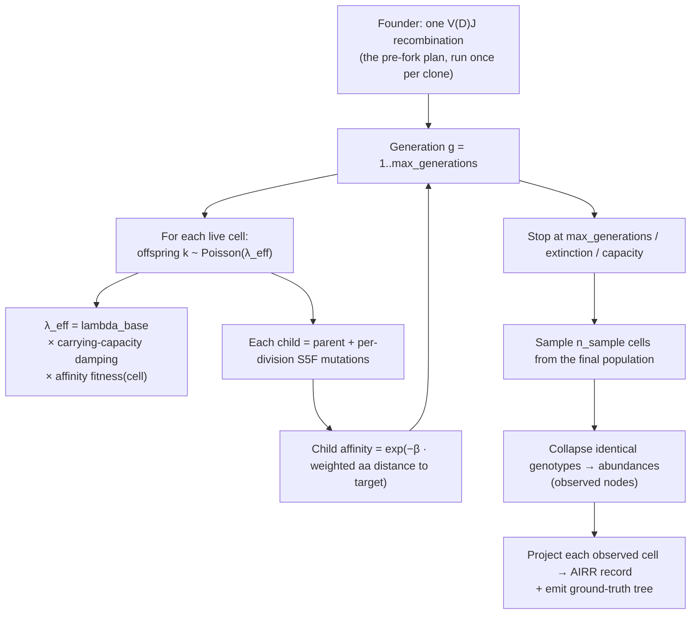
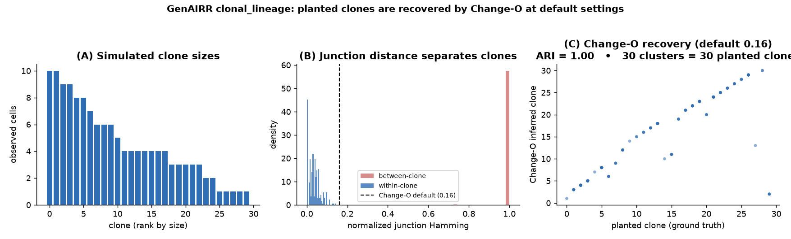

# Clonal lineage trees (affinity maturation)

<p class="lead">Where <a href="clonal-families.html"><code>expand_clones</code></a>
produces a <em>star</em> — one founder and many independent descendants —
<code>clonal_lineage</code> grows a real <em>tree</em>: a generation-by-generation
birth–death process in which cells divide, somatically hypermutate, are selected
for antigen affinity, and are finally sampled. The output is a set of
per-cell AIRR records <em>plus</em> the ground-truth lineage tree (topology,
ancestral sequences, abundances) — exactly what B-cell lineage-inference tools
(GCtree, IgPhyML, dowser, Change-O) are built to reconstruct. This page explains
precisely how it works under the hood; nothing here is a black box.</p>

## Why a tree, not a star

A clonal family in vivo is the progeny of one naive B cell that has entered a
germinal center. Inside that germinal center the cell **divides**, its B-cell
receptor **somatically hypermutates** a few bases per division, and cells whose
mutated receptor **binds the antigen better** are preferentially expanded
(affinity maturation). The result is a genealogy with internal ancestors,
unequal branch lengths, and selective sweeps — a tree.

The older `expand_clones` collapses all of that into a star: it takes the founder
recombination and draws `per_clone` independent descendants directly off it. That
is fine for "many reads that share a V(D)J truth", but it has no genealogy, no
generations, no selection, and no ancestral nodes — so it cannot serve as ground
truth for lineage reconstruction. `clonal_lineage` adds the missing biology.

> T cells do **not** somatically hypermutate. A TCR "clone" is one rearrangement
> proliferated to many identical copies; the meaningful quantity is the
> **clone-size distribution**, not a mutation tree. GenAIRR models that with a
> separate heavy-tailed clone-size sampler (see
> [Clone-size distributions](#clone-size-distributions-tcr-and-repertoire-mix)).

## Quick start

```python
import GenAIRR as ga

result = (
    ga.Experiment.on("human_igh")
      .recombine()                       # the founder: one V(D)J recombination per clone
      .clonal_lineage(
          n_clones=20,                   # grow 20 independent families
          max_generations=6,             # germinal-center rounds
          n_max=300,                     # carrying capacity (cells per family)
          n_sample=30,                   # cells sampled per family at the end
          rate=0.01,                     # per-base S5F SHM rate, per division
          lambda_base=1.6,               # mean offspring per cell per generation
          selection_strength=10.0,       # 0 = neutral; >0 = affinity selection
      )
      .run_records(seed=0)
)

# Per-cell AIRR records, tagged with clone + lineage metadata:
for rec in result.records[:3]:
    print(rec["clone_id"], rec["lineage_node_id"], rec["lineage_generation"],
          rec["lineage_abundance"], rec["lineage_affinity"], rec["v_call"])

# Ground-truth trees, one per clone:
tree = result.lineage_trees[0]
tree.validate()                  # structural invariants (raises if malformed)
newick = tree.to_newick()        # true topology, branch length = per-edge mutations
fasta  = tree.to_fasta()         # every node's sequence (ancestral + observed)
table  = tree.to_node_table_tsv()
```

## How it works under the hood

Each clone is grown independently by a generation-synchronous birth–death process
in the Rust engine. The whole loop is deterministic for a given `seed`.



### 1. The founder

`recombine()` (everything before `clonal_lineage` in the chain) is the **per-clone**
phase: it runs once to produce the naive rearrangement — the V/D/J allele picks,
trims, NP bases, junction. That founder `Simulation` (and its recombination trace)
is the root of the tree. Clone *c* uses seed `seed + c × 1_000_000`, so families
are independent and reproducible.

### 2. Generation-synchronous birth–death

Growth proceeds in discrete generations. In each generation every currently-live
cell produces a number of offspring drawn from a Poisson distribution:

```
k ~ Poisson(λ_eff)
```

`k = 0` means the cell leaves no progeny (it becomes a tip); `k ≥ 1` creates `k`
children for the next generation. `λ_eff` is the base offspring rate `lambda_base`
modulated by two factors below.

### 3. Carrying capacity (logistic damping)

A germinal center is population-bounded, so the effective rate is damped as the
live population `P` approaches `n_max`:

```
λ_eff = lambda_base × max(0, 1 − P / n_max)
```

Near saturation `λ_eff → 0` and growth plateaus instead of exploding. A hard cap
also prevents the live set from exceeding `n_max` even on a lucky Poisson draw.

### 4. Per-division somatic hypermutation (S5F)

Every child is a clone of its parent's `Simulation` with a fresh round of somatic
hypermutation applied. GenAIRR reuses its **context-sensitive S5F** engine (the
same one behind `mutate(model="s5f")`): mutations are drawn from the 5-mer
mutability/substitution kernel (`s5f_model`, default `"hh_s5f"`) at per-base rate
`rate`, applied one at a time with the sequence context re-evaluated between
mutations. Because SHM only substitutes bases in place, each cell keeps the
founder's V/D/J assignments and region map — its germline ancestry stays intact,
which is what lets every node be projected to a correct AIRR record (below).

The branch length stored on each edge is the **realized** number of substitutions
introduced on that division.

### 5. Affinity selection

This is what turns a neutral tree into affinity maturation. Each cell has an
**affinity** to a target antigen:

```
affinity = exp(−beta · weighted_aa_distance(cell, target))
```

`weighted_aa_distance` is a **BLOSUM62 substitution-aware** amino-acid distance
between the cell's translated receptor and the target (region weights let CDRs be
emphasized; v1 uses uniform weights, with CDR3-weighting as a planned refinement).
`affinity` is 1.0 at the target and decays toward 0 as the cell diverges.

The target is either supplied by you (`target_aa=...`, an antigen amino-acid
sequence) or auto-generated as a "mature" target — the founder's amino-acid
sequence with `mature_substitutions` random residue changes (the standard
benchmark convention).

Affinity feeds back into the offspring rate through a **fitness multiplier**:

```
fitness = max(0, 1 + selection_strength · (affinity − founder_affinity))
λ_eff   = lambda_base × carrying_capacity_damping × fitness
```

`founder_affinity` is the affinity of the naive founder, so the founder has
fitness ≈ 1, cells that improve on it divide faster, and worse cells divide
slower — producing selective sweeps. **`selection_strength = 0` makes `fitness ≡ 1`,
i.e. a neutral tree** (byte-identical to growing with no selection at all).

> **Calibration note.** `exp(−beta · distance)` can underflow to ~0 for long
> receptor sequences at large `beta`, flattening selection. If you supply a full
> antigen `target_aa`, keep `beta` small (e.g. `1e-3`) or use the auto target.

### 6. Sampling and genotype collapse

When growth stops (at `max_generations`, extinction, or capacity), `n_sample`
cells are sampled uniformly from the final population. Cells with **identical
genotypes** are then collapsed: the first cell seen for a genotype becomes the
**observed** representative and accumulates an **abundance** count. This is the
standard germinal-center convention — it produces observed tips with multiplicities
and "sampled ancestor" nodes, exactly the structure abundance-aware tree methods
(e.g. GCtree) expect. Observed nodes are the ones that become AIRR records.

## What you get back

### Per-cell AIRR records

`result.records` is a list of full AIRR Rearrangement dicts, one per *observed*
(genotype-collapsed) cell. Each carries the founder's recombination provenance
(`v_call`, `d_call`, `j_call`, junction, …) — correct because the node's `Outcome`
reuses the founder's recombination trace — plus its own mutated `sequence`. Mutation
counts (`n_mutations`, `n_v_mutations`, …, and the IMGT-subregion counters) are
recomputed **from the cell's sequence vs. germline** — these are **net differences
from germline** (accumulated across all divisions from founder to leaf). Because
identical genotypes are collapsed before sampling, the number of records per clone
is ≤ `n_sample`; the `lineage_abundance` field accounts for the collapsed copies.

> **Branch lengths vs. record `n_mutations`.** Newick branch lengths
> (as returned by `to_newick()`) count the **per-division substitution events**
> along each edge — re-mutations of a site that was already mutated count again.
> The record field `n_mutations` is the **net difference from germline** at the
> leaf (a site mutated and then back-mutated is not counted). As a result,
> summing branch lengths root→leaf will generally exceed a leaf's `n_mutations`.
> Both quantities are standard and correct: branch lengths track evolutionary
> distance along an edge (as tools like GCtree and IgPhyML expect), while
> `n_mutations` tracks the observable deviation from germline (as AIRR requires).

Consistency check: `n_v + n_d + n_j + n_np == n_mutations` holds for every record.

Lineage metadata stamped on every record:

| Field | Meaning |
|---|---|
| `clone_id` | Which family (0 … n_clones−1) — the ground-truth clone label |
| `lineage_node_id` | The cell's node id within its tree |
| `lineage_parent_id` | Parent node id (−1 for the founder) |
| `lineage_generation` | Generation depth (founder = 0) |
| `lineage_abundance` | Observation count after genotype collapse |
| `lineage_affinity` | Affinity to the target (0 in neutral mode) |

### Ground-truth lineage trees

`result.lineage_trees` is one `LineageTree` per clone. Each tree exposes the full
genealogy (every node, not just observed ones) and three exporters consumed by
inference tools:

- `to_newick()` — standard rooted Newick; the founder is the root, branch lengths
  are per-edge mutation counts. (`((node3:1)node1:1,node2:1)node0;`)
- `to_fasta()` — every node's sequence, ancestral and observed, so
  ancestral-sequence-reconstruction can be scored against truth.
- `to_node_table_tsv()` — `node_id, parent_id, generation, mutations_from_parent,
  abundance, observed, affinity, sequence`.
- `nodes()` / `validate()` — node access and a structural-invariant check.

## Clone-size distributions (TCR and repertoire mix)

Real repertoires are not uniform: a few clones are huge, most are singletons. The
engine includes heavy-tailed **clone-size distributions** (`CloneSizeDist`:
power-law/Zipf by default, log-normal optional) and a repertoire-composition
sampler that draws a set of clone sizes with a controllable **unexpanded fraction**
(size-1, never-expanded clones). For TCR — which has no SHM — a clone is simply one
rearrangement at copy-number `size`, with within-clone variation coming only from
the existing sequencing/PCR-error passes. These primitives are the basis for
mixing large expanded families with a realistic singleton tail.

## Determinism

Everything is keyed on `seed`. Clone *c* grows from `seed + c × 1_000_000`;
within a clone, generations, divisions, mutations, and sampling all draw from
seeded RNG streams (growth and sampling use separate streams so they don't
interfere). Re-running with the same seed reproduces the trees and records
byte-for-byte.

## Parameters

| Parameter | Default | Meaning |
|---|---|---|
| `n_clones` | — | Number of independent families to grow |
| `max_generations` | 10 | Germinal-center rounds (≤ 1000) |
| `n_max` | 1000 | Carrying capacity (live cells per family) |
| `n_sample` | 50 | Cells sampled per family at the end; records per clone ≤ this (genotype-collapsed) |
| `rate` | 0.05 | Per-base S5F SHM rate, per division |
| `lambda_base` | 1.5 | Mean offspring per cell per generation |
| `selection_strength` | 0.0 | Neutral drift by default (`lineage_affinity ≡ 0`); set `> 0` for affinity selection |
| `beta` | 1.0 | Affinity steepness in `exp(−beta·distance)` |
| `target_aa` | `None` | Amino-acid sequence of the full receptor used as the antigen target (BLOSUM62-weighted distance, position-wise; only the overlapping prefix is scored when lengths differ). `None` ⇒ auto "mature" target |
| `mature_substitutions` | 5 | aa substitutions for the auto target |
| `s5f_model` | `"hh_s5f"` | Bundled S5F kernel |

## Validated against community tools

The point of planting ground-truth clones is that **other people's tools can find
them**. They can. On a realistic-SHM run, Immcantation's **Change-O**
`DefineClones` at its **default** junction-distance threshold (0.16) recovers the
planted clones exactly.



*30 clones simulated with `clonal_lineage` (human IGH, realistic SHM). **(A)** the
repertoire has a realistic spread of clone sizes. **(B)** within-clone junction
distances sit far below Change-O's default 0.16 threshold while between-clone
distances are ~1.0 — the planted clones are cleanly separable. **(C)** Change-O at
its default threshold recovers all 30 planted clones (adjusted Rand index = 1.0,
precision = recall = 1.0).*

### Reproduce it: run Change-O on a simulated repertoire

```python
import GenAIRR as ga
import pandas as pd

result = (ga.Experiment.on("human_igh").recombine()
          .clonal_lineage(n_clones=30, max_generations=3, n_max=300,
                          n_sample=20, rate=0.008, lambda_base=1.6,
                          selection_strength=0.3)
          .run_records(seed=42))

# Write an AIRR-format TSV. Keep the ground-truth clone label under a NON-AIRR
# name so it doesn't collide with the tool's inferred `clone_id` column.
df = pd.DataFrame(result.records)
df = df.rename(columns={"clone_id": "true_clone_id"})
df.to_csv("repertoire.tsv", sep="\t", index=False)
```

```bash
# Immcantation Change-O (pip install changeo) infers clones from junctions:
DefineClones.py -d repertoire.tsv --format airr \
    --act set --model ham --norm len --dist 0.16 -o clones.tsv
```

Comparing Change-O's inferred `clone_id` against the planted `true_clone_id`
(e.g. with `sklearn.metrics.adjusted_rand_score`) gives **ARI = 1.0** — a perfect
match.

### What the validation shows across SHM regimes

- **Perfect precision, always.** Across every tool and threshold tested, two
  *different* planted clones are never merged. The per-clone founding
  rearrangements are distinct, so the planted signal is unambiguous.
- **Full recovery at a matched threshold.** Detection is a function of how mutated
  the lineage is versus the caller's distance cutoff. At realistic SHM, the default
  0.16 cutoff recovers everything; for deeply matured lineages (e.g. `rate=0.05`,
  6 generations → ~21 % SHM) you raise the cutoff (a threshold sweep climbs from
  ARI 0.26 at 0.16 → 0.91 at 0.30 → 1.0 at 0.45). This mirrors how these tools
  behave on real data and is **not** a property of the simulator.
- **Independent of any one tool.** The same recovery holds for an
  implementation-independent V/J + junction-length + single-linkage clusterer, and
  the exported Newick/FASTA feed tree-based methods (GCtree, IgPhyML, dowser)
  directly.

In short: the clones GenAIRR plants are the clones the ecosystem detects.

## Relationship to `expand_clones`

`expand_clones` (the star model) is **deprecated** but still works — it remains
useful for "many reads sharing one V(D)J truth" without a genealogy. For real
clonal trees, ground-truth lineages, and affinity maturation, use
`clonal_lineage`.
