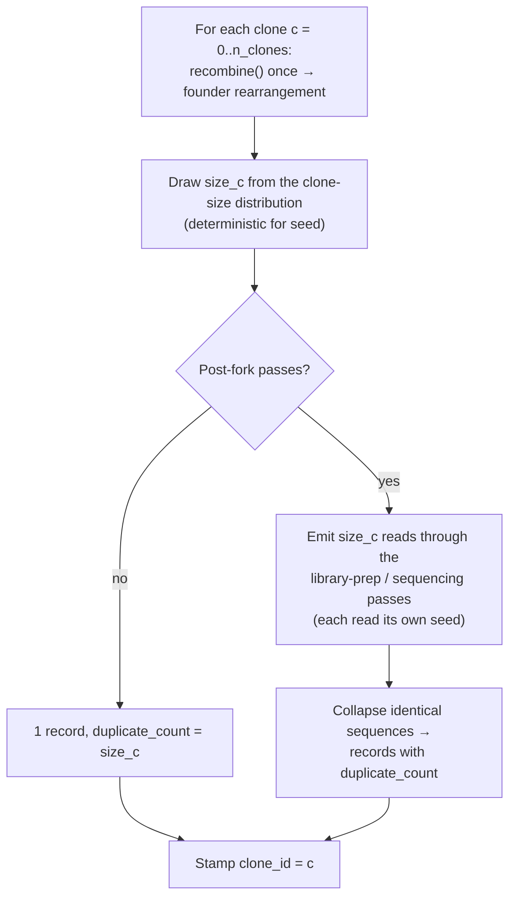

# Clonal repertoires (TCR & abundance)

<p class="lead">Where <code>clonal_lineage</code> grows BCR affinity-maturation <em>trees</em>, <code>clonal_repertoire</code> builds
a <em>non-tree</em> clonal repertoire: each clone is one rearrangement proliferated
to a clone <strong>size</strong> drawn from a heavy-tailed distribution, and those
copies are emitted as reads through the library-prep / sequencing passes. Identical
reads collapse into AIRR records carrying the AIRR-standard <code>duplicate_count</code>.
It is the model for <strong>TCR</strong> repertoires (T cells don't somatically
hypermutate) and for <strong>flat BCR</strong> clonal abundance — the modern
replacement for the deprecated <code>expand_clones</code>, with realistic clone
sizes instead of a fixed per-clone count.</p>

## What it is & when to use it

A real repertoire is a population of clones with wildly uneven sizes: a few huge
expanded clones and a long tail of singletons. `clonal_repertoire` reproduces that
structure. For each of `n_clones` clones it:

1. runs the pre-fork plan (`recombine()`) **once** to fix the clone's
   V/D/J + trim + NP backbone — the single rearrangement that defines the clone;
2. draws a **size** from a heavy-tailed clone-size distribution (rounded
   power-law / Zipf-like by default, log-normal optional), with a controllable
   **unexpanded-singleton fraction**;
3. emits that many **reads** through the post-fork library-prep / sequencing passes,
   so reads diverge only by technical noise;
4. **genotype-collapses** identical reads into AIRR records, each carrying a
   `clone_id` (ground-truth clone label) and a `duplicate_count` (abundance).

Reach for it when you want a repertoire whose **ground truth is clone membership +
abundance** — the input clone-callers and abundance-aware tools expect — rather than
a per-clone mutation genealogy.

### How it compares

| | What it models | Ground truth | Loci |
|---|---|---|---|
| **`clonal_repertoire`** | Non-tree clonal abundance; one rearrangement × N copies + technical noise | `clone_id` + `duplicate_count` | **TCR** and flat **BCR** |
| [`clonal_lineage`](clonal-lineage.md) | BCR affinity-maturation **trees** (per-division SHM, selection) | Lineage tree + per-cell records | **BCR only** |
| `expand_clones` *(deprecated)* | Star: fixed `per_clone` count, **no** size distribution | `clone_id` + `parent_id` | BCR / TCR |

`clonal_repertoire` is the modern replacement for flat clonal expansion: instead of
`expand_clones`' fixed `per_clone` count, every clone draws a realistic heavy-tailed
size. For BCR **lineage trees** (genealogy, ancestral sequences, selection), use
[`clonal_lineage`](clonal-lineage.md) instead.

## The biology

A T-cell clone is the progeny of one rearranged T cell proliferated to many
**identical** copies. T cells do **not** somatically hypermutate, so all the
sequence diversity you observe *within* a TCR clone is **technical** — PCR and
sequencing error introduced during library prep — not biological. That is exactly
the shape `clonal_repertoire` produces: one rearrangement per clone, `size` copies,
divergence only through the post-fork sequencing passes.

Clone **sizes** are empirically heavy-tailed — TCR clone-size distributions are
approximately **power-law** (a handful of enormous clones, a long tail of
singletons). The default `size_distribution="power_law"` (with `exponent≈2`)
captures that, and `unexpanded_fraction` sets the share of clones forced to be
**never-expanded singletons** (size 1) — the resting naive cells that were never
clonally expanded.

For **BCR** the same flat model is useful when you want clonal abundance without a
genealogy. SHM is optional and applied flat across the clone's copies via a
post-fork `.mutate()` (see below) — there is no mutation tree.

## Quick start (TCR)

```python
import GenAIRR as ga

result = (ga.Experiment.on("human_tcrb").allow_curatable_refdata().recombine()
          .clonal_repertoire(n_clones=200, size_distribution="power_law",
                             exponent=2.0, max_size=500, unexpanded_fraction=0.5)
          .sequencing_errors(rate=0.005)         # per-read technical noise
          .run_records(seed=0))

# Each record carries a ground-truth clone label + an abundance count:
for rec in result.records[:5]:
    print(rec["clone_id"], rec["duplicate_count"], rec["v_call"], rec["j_call"])

# T cells don't hypermutate — every record has zero SHM:
assert all(rec.get("n_mutations", 0) == 0 for rec in result.records)
```

`allow_curatable_refdata()` is the usual opt-in for sampling from the bundled TCR
catalogue (which includes pseudogene/ORF alleles). `sequencing_errors(rate=...)` is
the per-read technical-noise pass — `rate` is a per-base error probability in
`[0, 1]` (drawn as `count ~ Poisson(rate × read_len)` per read). `pcr_amplify(rate=...)`
has the same shape; any of the post-fork library-prep passes
(`sequencing_errors`, `pcr_amplify`, `polymerase_indels`, `end_loss_*`,
`ambiguous_base_calls`, `random_strand_orientation`) can follow the fork.

## Quick start (flat BCR with SHM)

The same model works for BCR. Optionally add a post-fork `.mutate()` to apply flat
SHM independently to each copy (this is **not** a lineage tree — it's per-read
mutation off the shared founder):

```python
import GenAIRR as ga

result = (ga.Experiment.on("human_igh").recombine()
          .clonal_repertoire(n_clones=100, max_size=300, unexpanded_fraction=0.3)
          .mutate(model="s5f", rate=0.01)        # flat SHM on each copy
          .sequencing_errors(rate=0.005)
          .run_records(seed=0))
```

With **no** post-fork passes at all, every copy of a clone is identical, so the
clone collapses to a **single** record whose `duplicate_count` equals the drawn
size:

```python
r = (ga.Experiment.on("human_igh").recombine()
     .clonal_repertoire(n_clones=10, max_size=100)
     .run_records(seed=1))

from collections import Counter
per_clone = Counter(rec["clone_id"] for rec in r.records)
assert all(c == 1 for c in per_clone.values())     # one record per clone
assert all(rec["duplicate_count"] >= 1 for rec in r.records)
```

> **`mutate` is BCR-only.** A post-fork `.mutate()` on a **TCR** experiment is
> rejected by `mutate`'s own TCR guard — T cells don't hypermutate. On TCR, leave
> SHM out; the post-fork sequencing passes provide all within-clone variation.

## How it works



Per clone, the engine draws the size, runs the founder recombination once, then
plays `size` reads through the post-fork plan (each with its own derived seed) and
collapses by emitted `sequence`. `clone_id` is the ground-truth clone index;
`duplicate_count` is the post-collapse abundance.

**Determinism.** Everything is keyed on `seed`: clone sizes come from a seeded draw,
clone *c* recombines from `seed + c × 1_000_000`, and each read within a clone draws
from a derived sub-seed. Re-running with the same `seed` reproduces the records and
`duplicate_count`s byte-for-byte.

**Read-count cost.** When post-fork passes are present, the **total reads simulated
is roughly the sum of the drawn clone sizes** (before collapse). A heavy tail with a
large `max_size` can therefore blow up runtime — keep `max_size` modest (the default
is 1000) and remember a few clones near `max_size` dominate the cost.

## Parameters

| Parameter | Default | Meaning |
|---|---|---|
| `n_clones` | — | Number of clones to simulate (positive int). Sets the number of distinct `clone_id`s. |
| `size_distribution` | `"power_law"` | Clone-size law: `"power_law"` (Zipf-like, heavy-tailed) or `"lognormal"`. |
| `exponent` | `2.0` | Power-law exponent (`> 0`), used when `size_distribution="power_law"`. Higher ⇒ steeper tail / more singletons; `~2–3` is typical for TCR. |
| `mu` | `1.0` | Log-normal location parameter, used when `size_distribution="lognormal"`. |
| `sigma` | `1.0` | Log-normal scale (`>= 0`), used when `size_distribution="lognormal"`. Larger ⇒ heavier tail. |
| `max_size` | `1000` | Upper clamp on any clone size. Bounds runtime (total reads ≈ Σ sizes when post-fork passes are present) — keep it modest. |
| `unexpanded_fraction` | `0.0` | Fraction of clones **forced** to size 1 (never-expanded singletons), in `[0, 1]`. The forced count is `round(n_clones × fraction)`. |

> **Singletons come from two places.** The power-law size is drawn by a **continuous
> inverse-CDF** and then **rounded** to an integer in `[1, max_size]`, so even with
> `unexpanded_fraction=0` a large share of clones round to size 1 (for `exponent=2`
> the singleton share is **~1/3**). `unexpanded_fraction` adds a *forced* floor of
> size-1 clones **on top of** that natural tail, so raise it when you want an even
> larger never-expanded population. Because the power-law is a continuous draw that
> is rounded — not an exact discrete Zipf PMF — the realized distribution is an
> approximation of true discrete Zipf.

## Ground truth & tooling

Each record carries the two ground-truth fields the downstream ecosystem consumes:

- **`clone_id`** — the planted **clone membership** label (which rearrangement this
  read descends from).
- **`duplicate_count`** — the **abundance** of the collapsed record (AIRR-standard
  field name).

Write the records to an AIRR TSV (keeping the ground-truth label under a non-AIRR
column name so it doesn't collide with a tool's inferred `clone_id`):

```python
import pandas as pd
df = pd.DataFrame(result.records).rename(columns={"clone_id": "true_clone_id"})
df.to_csv("repertoire.tsv", sep="\t", index=False)
```

The output format is **what clone-callers and abundance-aware tools consume** —
Change-O `DefineClones` and SCOPer read AIRR TSV with `duplicate_count`, and TCR
tools like tcrdist read V/J + junction. You can score a tool's inferred clusters
against the planted `true_clone_id` (e.g. with `sklearn.metrics.adjusted_rand_score`).
We frame the records as **format-compatible** with these tools; this page does **not**
claim they were validated against `clonal_repertoire` output here.

## Limitations

- **No mutation tree.** `clonal_repertoire` is a flat, non-tree model — there are no
  ancestral nodes, generations, or selection. For a BCR genealogy (Newick / FASTA /
  node table, affinity maturation), use [`clonal_lineage`](clonal-lineage.md).
  A post-fork `.mutate()` on BCR applies *flat* SHM per copy, not a lineage.
- **Power-law is continuous-rounded, not exact discrete Zipf.** Sizes come from a
  continuous inverse-CDF rounded to integers; this approximates true discrete Zipf
  rather than matching its PMF exactly.
- **Cost scales with Σ sizes.** With post-fork passes present, the simulator emits
  roughly the sum of the drawn sizes in reads before collapse. Large clones combined
  with heavy post-fork passes mean many reads — keep `max_size` modest.
- **One fork per pipeline.** `clonal_repertoire`, `expand_clones`, and
  `clonal_lineage` are mutually exclusive in a single chain; descendant-phase steps
  (e.g. `.mutate()`, the corruption passes) must come **after** the fork.
