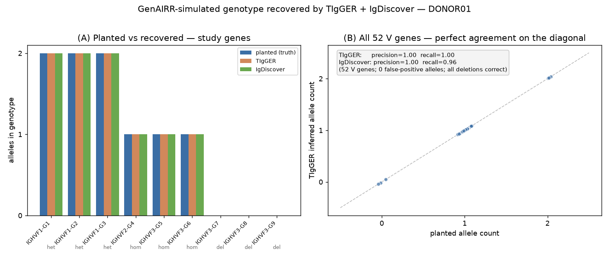

# Genotypes: per-individual diploid germline

<p class="lead">A <strong>genotype</strong> in GenAIRR is one person's diploid germline
complement — which V/D/J alleles they carry, on which chromosome, in what copy
number. Attach a <code>Genotype</code> to an <code>Experiment</code> and V(D)J
recombination becomes <strong>haplotype-phased</strong>: the V, D and J of each
rearrangement are drawn from a single chromosome, honouring allele
presence/absence, zygosity, and gene deletion. With no genotype attached the
engine is byte-for-byte unchanged. This page explains exactly what a genotype is,
how the engine samples from it, how to build one, and how to use it to benchmark
genotype-inference tools — nothing here is a black box.</p>

## What a genotype is (and why it matters)

Every person inherits two copies of the immunoglobulin heavy-chain locus — one on
each homologous chromosome (one **haplotype** from each parent). Across the
population the locus is extraordinarily polymorphic: a reference set may list
dozens of alleles per gene, but a *single individual* carries only a handful —
typically **one or two alleles per gene** — and may be **missing entire genes**
(deletion) or carry **extra copies** (duplication). That per-individual set is the
**genotype**.

GenAIRR models four things a genotype encodes:

| Concept | Meaning | In GenAIRR |
|---|---|---|
| **Allele presence/absence** | only carried alleles can rearrange | alleles not in the genotype are never sampled |
| **Diploid zygosity** | per gene: 1 allele (homozygous) or 2 (heterozygous) | `homozygous` / `heterozygous` |
| **Gene deletion / copy number** | a gene can be absent on one or both chromosomes, or duplicated | `delete_gene` / `duplicate_gene` |
| **Haplotype phasing** | V, D, J of one rearrangement come from one chromosome | drawn automatically, recorded per record |

Phasing is what makes a genotype more than "a list of alleles to allow". The IGH
locus is physically on a chromosome, so a single recombination event splices a V,
a D and a J **from the same chromosome**. That linkage is exactly the signal
haplotype-inference methods exploit (e.g. the IGHJ6-anchor approach), and GenAIRR
reproduces it.

!!! note "Supported loci and chains"
    Genotypes work on any GenAIRR reference cartridge — BCR **and** TCR, heavy
    **and** light/α/β chains. On **VDJ** loci (IGH, TRB, TRD) the genotype spans
    V, D and J and each rearrangement draws all three from one chromosome. On
    **VJ** loci (IGK, IGL, TRA, TRG) there is no D segment: genotype V and J,
    D rows are simply not required and are ignored. The examples below use the
    human IGH cartridge, but the same API applies to every locus; just use that
    cartridge's gene/allele names.

## Quick start

```python
import GenAIRR as ga
import GenAIRR.data as gdata
from GenAIRR.genotype import Genotype

cfg = gdata.HUMAN_IGH_OGRDB

# Build a diploid genotype: start from the reference, then edit specific genes.
g = (
    Genotype.from_dataconfig(cfg)
      .complete_from_reference("homozygous_first_reference")  # fill the rest
      .heterozygous("IGHVF1-G1", "IGHVF1-G1*01", "IGHVF1-G1*02")  # two alleles
      .homozygous("IGHVF2-G4", "IGHVF2-G4*01")                    # one allele
      .delete_gene("IGHVF3-G7", haplotype="both")                 # gene absent
      .with_subject("DONOR01")
)

result = (
    ga.Experiment.on(cfg)
      .with_genotype(g)        # recombination is now haplotype-phased
      .recombine()
      .run_records(n=1000, seed=7)
)

result[0]["subject_id"]          # 'DONOR01'   — provenance on every record
result[0]["haplotype"]           # 0 or 1      — which chromosome this read used
result.genotypes[0].to_table()   # ground-truth genotype (per gene, per haplotype)
```

## How recombination samples from a genotype

When a genotype is attached, recombination runs a single phased sampling pass per
rearrangement. The steps, in order:

1. **Draw a chromosome.** One of the two haplotypes is chosen, weighted by the
   `chromosome_weights` (default `[0.5, 0.5]`). This choice is made **once** and
   shared by V, D and J — that is the phasing.
2. **Per segment, draw a gene then an allele.** Among the genes *present on the
   chosen chromosome*, a gene is sampled (weighted by usage — see below), then the
   allele follows from that chromosome's slot for the gene. A deleted gene is
   simply not offered on the chromosome that lacks it.
3. **Assign and continue.** The chosen V/D/J alleles are assigned and the rest of
   the pipeline (trimming, NP, assembly, SHM, corruption) runs unchanged.

Every random choice (chromosome, gene, within-slot allele) is recorded to the
trace, so seeded runs are byte-stable and fully replayable.

### Viability and `productive_only`

A chromosome is only drawn if it is **viable** — it must carry at least one usable
allele for every required segment (V and J, plus D on heavy chains). This matters
with deletions: if one haplotype lacks a J gene entirely, only the other
chromosome is ever drawn. If **neither** chromosome can produce a rearrangement,
the genotype is rejected at compile time with a clear error (rather than failing
at run time).

Under [`productive_only`](productive.md), viability also accounts for
productive-junction feasibility, and the V chosen earlier in the pass constrains
the J drawn later (the phased choices are evaluated together, not independently).

### Strict vs permissive

`Genotype.from_dataconfig(cfg)` is **strict**: any gene that could be used during
recombination but was never specified is an error when the experiment is compiled
(`compile()` / `run_records()`) — you must define
the whole genotype (use `complete_from_reference` to fill the genes you don't care
about). This guarantees a genuine diploid complement, which is what you want for a
ground-truth benchmark.

`Genotype.permissive(cfg)` is a separate, explicitly **non-diploid** fallback:
unspecified genes are left to sample over *all* their reference alleles without
phasing. It exists for the "I only want to constrain a few genes" case — it is
**not** a biological genotype, and it is labelled as such in `to_table()` and
`repr`.

In both modes, feasibility (e.g. `productive_only`) is applied the same way the
non-genotype path applies it: candidates are filtered to the feasible set, and the
unfiltered set is used only as a last resort when nothing is feasible — so a
genotype run never silently samples alleles a normal run would have avoided.

## Building a genotype

The `Genotype` builder is a fluent, validated editor over a `DataConfig`'s
reference alleles. Every method returns `self`, so calls chain.

```python
g = Genotype.from_dataconfig(cfg)                       # strict (recommended)

g.homozygous("IGHVF2-G4", "IGHVF2-G4*01")               # 1 allele on both chromosomes
g.heterozygous("IGHVF1-G1", "IGHVF1-G1*01", "IGHVF1-G1*02")  # different allele per chromosome
g.delete_gene("IGHVF3-G7", haplotype="both")            # gene absent entirely (homozygous deletion)
g.homozygous("IGHVF3-G8", "IGHVF3-G8*01")               # carried on both chromosomes...
g.delete_gene("IGHVF3-G8", haplotype=1)                 # ...then removed on chromosome 1 (hemizygous)
g.duplicate_gene("IGHVF1-G2", ["IGHVF1-G2*01", "IGHVF1-G2*02"], haplotype=0)  # >1 copy on one chromosome
g.chromosome_weights(0.6, 0.4)                          # allelic-expression imbalance
g.with_subject("DONOR01")                               # provenance label

g.complete_from_reference("homozygous_first_reference") # fill every unspecified gene
```

Every editing method takes a `segment` argument (`"V"` default, or `"D"` / `"J"`),
so genotype the D and J loci too — important since J anchors and D/J usage drive
haplotype-inference methods:

| Method | Signature | Notes |
|---|---|---|
| `homozygous` | `(gene, allele, segment="V")` | one allele on both chromosomes |
| `heterozygous` | `(gene, allele0, allele1, segment="V")` | one allele per chromosome |
| `delete_gene` | `(gene, haplotype="both"\|0\|1, segment="V")` | whole-gene or one-chromosome (hemizygous) deletion |
| `duplicate_gene` | `(gene, alleles=[...], haplotype=0\|1, segment="V")` | >1 copy on one chromosome |
| `add_novel_allele` | `(name, *, base, mutations\|sequence, segment="V", allow_nonfunctional=False)` | define a private allele (see below) |
| `chromosome_weights` | `(w0, w1)` | allelic-expression imbalance (default 0.5/0.5) |
| `with_subject` | `(sid)` | provenance label stamped on every record |
| `complete_from_reference` | `(policy="homozygous_first_reference"\|"heterozygous_first_two")` | fill unspecified genes |

```python
# Genotype the J locus too — e.g. heterozygous IGHJ6 + a homozygous IGHJ4:
g.heterozygous("IGHJ6", "IGHJ6*02", "IGHJ6*03", segment="J")
g.homozygous("IGHJ4", "IGHJ4*02", segment="J")
```

Notes and guard-rails:

- **`delete_gene(..., haplotype=0|1)`** (one chromosome) requires the gene to be
  specified first — deleting a single haplotype of an *unspecified* gene would
  silently delete both, so it raises instead.
- **`complete_from_reference(policy=...)`** fills only genes you haven't touched.
  `"homozygous_first_reference"` (default) makes each unspecified gene homozygous
  for its first cartridge allele — note this is the *first listed* allele, **not**
  a population-frequency-common one (GenAIRR has no frequency prior in this
  release; the name says exactly what it does). `"heterozygous_first_two"` uses
  the first two alleles.
- Unknown gene/allele names, NaN/inf chromosome weights, and segments left with no
  usable allele are all rejected at build/attach with clear messages.
- `with_genotype` is **mutually exclusive** with
  [`restrict_alleles`](../reference/experiment.md) and the
  `recombine(*_allele_weights=...)` kwargs — the genotype owns allele presence and
  expression. It is also rejected together with `receptor_revision` and with the
  clonal forks (`expand_clones` / `clonal_lineage` / `clonal_repertoire`) in this
  release (see [Limitations](#limitations-this-release)).

### Gene usage

Within a chromosome, which *gene* is used is weighted by the cartridge's typed
allele-usage model (`reference_models.allele_usage`), aggregated to the gene
level, and scaled by **copy-number dosage** (a duplicated gene recombines
proportionally more often). Cartridges that don't author a typed `allele_usage`
fall back to uniform-over-present-genes (× dosage). See
[Allele usage](v-usage.md) and [Estimate models from data](estimate-cartridge-models.md)
for authoring usage.

### More genotype recipes

**A richer diploid genotype** — several heterozygous genes, a homozygous gene,
a whole-gene (homozygous) deletion, a hemizygous deletion, and allelic-expression
imbalance, with everything else filled from the reference:

```python
g = (
    Genotype.from_dataconfig(cfg)
      .heterozygous("IGHVF1-G1", "IGHVF1-G1*01", "IGHVF1-G1*02")
      .heterozygous("IGHVF1-G2", "IGHVF1-G2*01", "IGHVF1-G2*02")
      .homozygous("IGHVF2-G4", "IGHVF2-G4*01")
      .delete_gene("IGHVF3-G7", haplotype="both")     # absent on both chromosomes
      .homozygous("IGHVF3-G8", "IGHVF3-G8*01")        # carried on both...
      .delete_gene("IGHVF3-G8", haplotype=1)          # ...then removed on chr 1 (hemizygous)
      .chromosome_weights(0.65, 0.35)                 # chromosome 0 expressed more
      .complete_from_reference()                      # the remaining genes
      .with_subject("DONOR_A")
)
```

**Gene duplication** — one chromosome carries two alleles of the same gene
(specify the gene on both chromosomes first, then add the extra copy to one):

```python
g = (
    Genotype.from_dataconfig(cfg)
      .homozygous("IGHVF1-G3", "IGHVF1-G3*01")                          # both chromosomes carry *01
      .duplicate_gene("IGHVF1-G3", ["IGHVF1-G3*01", "IGHVF1-G3*02"], haplotype=0)  # chr 0 now carries two copies
      .complete_from_reference()
      .with_subject("DONOR_DUP")
)
# chromosome 0 carries {*01, *02}, chromosome 1 carries {*01};
# the extra copy raises this gene's recombination share (copy-number dosage).
```

**Build a fully-specified strict genotype programmatically** — drive the builder
from a per-gene plan (the natural shape if you load a genotype from a table or
generate many subjects):

```python
plan = {
    "IGHVF1-G1": ("IGHVF1-G1*01", "IGHVF1-G1*02"),  # 2 alleles  -> heterozygous
    "IGHVF1-G2": ("IGHVF1-G2*01",),                 # 1 allele   -> homozygous
    "IGHVF3-G7": (),                                 # 0 alleles  -> deleted
    # ... one entry per gene you want to pin
}

g = Genotype.from_dataconfig(cfg)
for gene, alleles in plan.items():
    if not alleles:
        g.delete_gene(gene, haplotype="both")
    elif len(alleles) == 1:
        g.homozygous(gene, alleles[0])
    else:
        g.heterozygous(gene, alleles[0], alleles[1])
g.complete_from_reference().with_subject("DONOR_B")
```

**Inspect the non-trivial genes** of any genotype:

```python
for row in g.to_table():
    if row["zygosity"] != "homozygous":
        print(row["gene"], row["zygosity"], row["haplotype_0"], row["haplotype_1"])
```

## Sampling from population priors

Instead of specifying every gene, draw a plausible diploid genotype with
`Genotype.sample`. It uses an **independent per-gene, per-chromosome
Hardy-Weinberg model**: each gene on each chromosome is independently deleted
(`haplotype_deletion_prob`) or assigned an allele from that gene's frequencies, so
homozygous / heterozygous / hemizygous / deleted states emerge at the expected
rates.

```python
g = Genotype.sample(
    cfg,
    seed=7,
    allele_frequencies={                 # {segment: {gene: {allele: weight}}}
        "V": {"IGHVF1-G1": {"IGHVF1-G1*01": 8, "IGHVF1-G1*02": 2}},
    },                                   # unspecified genes -> uniform within gene
    haplotype_deletion_prob=0.05,        # 5% per-haplotype gene-absence
    subject_id="DONOR_R1",
)
res = ga.Experiment.on(cfg).with_genotype(g).recombine().run_records(n=500, seed=1)
```

`Genotype.sample` always returns a **fully-specified, runnable** genotype. By
default `ensure_viable=True` re-draws (up to `max_resamples`, deterministically)
until at least one **expressible** (positive-weight) chromosome carries every
required segment, raising a clear error only if your deletion settings make that
impossible; pass `ensure_viable=False` to allow infeasible draws.

!!! note "Default sampling is HW *conditioned on viability*"
    With the default `ensure_viable=True`, draws that leave no complete usable
    haplotype are rejected, so per-gene deletion/zygosity rates are Hardy-Weinberg
    **conditioned on at least one viable chromosome** — not the unconditional HW
    rates. This only matters at high `haplotype_deletion_prob` (e.g. a single-J
    cartridge with a high J-deletion prob). Use `ensure_viable=False` for the raw,
    unconditional draw (which may be infeasible and rejected at compile).

Frequency priors accept the segment-aware
`{segment: {gene: {allele: weight}}}` shape (or a flat `{gene: …}` when the gene is
unambiguous); a supplied gene's listed alleles define its distribution (weight `0`
excludes an allele), and unspecified genes fall back to uniform.
`haplotype_deletion_prob` is a float or a per-gene/per-segment dict.

!!! warning "What this model is — and isn't"
    This is an **independent per-gene** sampler. It does **not** model linkage
    disequilibrium, gene co-deletion blocks, ancestry, or donor-specific haplotype
    structure, and it samples **catalogue alleles only** (no novel alleles) and
    **deletion only** (no duplication). Supply explicit `allele_frequencies` from a
    population source (e.g. VDJbase) for realistic per-gene frequencies; the default
    is uniform within each gene. `allele_frequencies="usage_as_prior"` is an
    explicit opt-in that reuses the cartridge's recombination `allele_usage` as a
    frequency proxy — convenient but biologically approximate.

## Population genotype models on a cartridge

The `allele_frequencies` / `haplotype_deletion_prob` you pass to
`Genotype.sample` can instead be **authored once on the cartridge** as a
*population genotype model* — a donor-population germline prior. It is a distinct
plane from `reference_models.allele_usage`: `allele_usage` weights how often each
allele is *expressed* during recombination, whereas a genotype prior describes
which alleles a *donor population carries* (frequencies, gene-deletion rates, and
population novel alleles). It lives on `DataConfig.genotype_priors`.

### Authoring and attaching a model

```python
from GenAIRR.genotype_priors import PopulationGenotypeModel, PopulationNovelAllele

model = PopulationGenotypeModel(
    model_id="IGH-toy-1", source="hand-authored",     # identity is required
    allele_frequencies={"V": {"IGHVF1-G1": {"IGHVF1-G1*01": 3.0, "IGHVF1-G1*02": 1.0}}},
    haplotype_deletion_prob={"V": {"IGHVF1-G1": 0.1}},
)
# Attach via the cartridge builder (validated against the chain type + catalogue):
#   cfg = builder.set_genotype_priors(model).build()
```

`set_genotype_priors` validates the model against the cartridge: unknown
genes/alleles raise, and any population novel allele goes through the same
functional validation as `add_novel_allele` (conserved anchor, stop-free frame,
base-allele match). A non-`None` plane becomes part of cartridge identity (it
folds into `compute_checksum()` and the manifest).

### Estimating a model from observed genotypes

Given a list of observed `Genotype` objects (e.g. one per donor), estimate a
prior directly:

```python
model = PopulationGenotypeModel.from_genotypes(
    [g_donor1, g_donor2, g_donor3],
    cfg=cfg, model_id="cohort-est", source="my-cohort",
)
# or, attaching to a builder in one chained step:
#   builder.estimate_genotype_priors([g_donor1, g_donor2, g_donor3], source="my-cohort")
```

Estimator conventions: allele frequencies are counted **per carried chromosome**
(homozygous contributes 2, hemizygous 1, deleted 0); gene deletion probability is
`deleted_haplotypes / (2 × n_subjects)`. `pseudocount` smooths the per-gene
catalogue-allele counts only (deletion gets none). Genotypes carrying a
duplicated gene are rejected — the plane is deletion-only.

### Drawing from the cartridge plane

When a cartridge carries a plane, `Genotype.sample(cfg)` **auto-uses it** and
records where every input came from:

```python
g = Genotype.sample(cfg, seed=7)        # plane supplies freqs / deletion / weights
print(g.prior_provenance)
# {'allele_frequencies': 'cartridge', 'haplotype_deletion_prob': 'cartridge',
#  'chromosome_weights': 'cartridge', 'novel_alleles': 'none',  # 'cartridge' if the model has novels
#  'model_id': 'IGH-toy-1', 'model_checksum': '…'}
print(g.to_metadata())                  # subject_id + provenance + source refdata hash
```

Pass `use_cartridge_priors=False` for a clean uniform, catalogue-only draw (all
plane consumption — including novels — disabled). Each input is sourced
**independently**, so you can mix explicit and cartridge values:

```python
g = Genotype.sample(
    cfg, seed=7,
    allele_frequencies={"V": {"IGHVF1-G1": {"IGHVF1-G1*01": 1.0}}},  # explicit
    # haplotype_deletion_prob and chromosome_weights left to the plane
)
print(g.prior_provenance["allele_frequencies"])      # 'explicit'
print(g.prior_provenance["haplotype_deletion_prob"]) # 'cartridge'
print(g.prior_provenance["chromosome_weights"])      # 'cartridge'
```

**Population novel alleles** on the plane are *candidate* alleles for the draw: a
novel that gets sampled is carried (and flows into `v_call` / reads / truth like
any allele); a novel that isn't drawn never pollutes the output reference. By
default (`include_cartridge_novel_alleles="auto"`) novels are injected only when
the allele frequencies are cartridge- or uniform-sourced — supplying an
**explicit** frequency table keeps it explicit. Pass
`include_cartridge_novel_alleles=True` to inject them anyway, or `False` to never.

### Auditing the plane

`cfg.cartridge_manifest()["models"]["genotype_priors"]` reports availability,
`model_id` / `source` / `version`, the plane's `model_checksum`, per-segment gene
counts, the novel-allele count, and `source_field` (`"DataConfig.genotype_priors"`).

## Novel / private alleles

Individuals carry germline alleles that aren't in any reference — *private* or
*novel* alleles. Discovering them is a central task for IgDiscover, partis, and
TIgGER's `findNovelAlleles`. GenAIRR can plant them as ground truth.

`add_novel_allele` derives a private allele from a reference **base** allele by
applying point `mutations` (or supplying an explicit `sequence` of the same
length), inheriting the base's gene, anchor, functional status and V sub-regions.
The novel allele is then placed like any allele, and at `compile()` time it is
injected into an **effective reference** (base catalogue + your private alleles)
so it flows through alignment and AIRR output as a genuine allele:

```python
g = (
    Genotype.from_dataconfig(cfg)
      .add_novel_allele("IGHVF1-G1*i01", base="IGHVF1-G1*01",
                        mutations=[(38, "C"), (41, "A")])   # two point variants
      .complete_from_reference()
      .heterozygous("IGHVF1-G1", "IGHVF1-G1*01", "IGHVF1-G1*i01")  # one reference + one private
      .with_subject("DONOR_N")
)

result = (
    ga.Experiment.on(cfg).with_genotype(g).recombine()
      .run_records(n=500, seed=3, expose_provenance=True)
)
# The private allele is sampled, assembled and reported like any allele —
# its name appears in v_call / truth_v_call and the reads carry its variants.
```

The novel allele's **gene is taken from its name** and must match the base
allele's gene; it must be a same-length (substitution-only) variant. The
synthesized coding sequence is **validated** — for V/J the conserved anchor codon
must still encode the conserved residue (Cys for V, Trp/Phe for J) and the coding
frame must be stop-free. A variant that breaks either is rejected unless you pass
`allow_nonfunctional=True` (then it is kept and marked non-functional). Novel
alleles are flagged in the ground truth: each `to_table()`/`to_tsv()` row carries
a `novel` list of the private alleles carried at that gene.

**Benchmarking novel-allele discovery.** Plant a novel allele, simulate, then run
the discovery tool against the **base** germline (the cartridge *without* your
private alleles) so the tool must rediscover it from the reads — and score its
output against the planted novel sequence. (Write the base germline FASTA from
`cfg.v_alleles`; write the truth from `genotype.to_table()`.)

## Ground truth and provenance

A genotype experiment emits, by construction, everything an evaluation needs:

- **Per-record fields:** `subject_id` and `haplotype` (`0`/`1`, the chromosome the
  rearrangement used) are stamped on every AIRR record. Standard truth columns
  (`truth_v_call`, …) are available with `expose_provenance=True`.
- **`result.genotypes`:** the list of attached `Genotype` objects (one per subject).
- **`Genotype.to_table()` / `to_tsv(path)`:** the ground-truth genotype as a table
  — one row per (segment, gene) with `zygosity`
  (`homozygous` / `heterozygous` / `hemizygous` / `deleted`), the carried alleles
  per haplotype, and per-haplotype `allele:copies:weight` detail. This is the
  reference a genotype-inference benchmark compares against.

```python
for row in result.genotypes[0].to_table():
    if row["zygosity"] != "homozygous":      # show the interesting genes
        print(row["gene"], row["zygosity"], row["haplotype_0"], row["haplotype_1"])
```

## Research workflow: benchmarking genotype inference

The point of simulating from a *known* genotype is that you can run a
genotype-inference tool on the resulting repertoire and score it against the
planted truth — with no real-data uncertainty about what the right answer is.

The recipe is the same for any tool:

1. Build a `Genotype`, simulate a repertoire, write the AIRR table
   (`result.to_tsv(...)`) and/or reads FASTA, and the ground truth
   (`genotype.to_tsv(...)`).
2. Run the inference tool to recover the per-individual allele set.
3. Compare recovered vs planted: presence/absence, zygosity, and (for
   discovery tools) any novel alleles.

### Worked example: TIgGER and IgDiscover recover a planted genotype

To show this end to end we planted a diploid IGH genotype in `human_igh` —
**3 heterozygous** V genes (two alleles each), **3 homozygous** (one allele),
and **3 fully deleted** genes — and filled the rest from the reference. We
simulated 4,000 reads with light SHM, then ran two independent AIRR
genotype-inference tools on the result:
[**TIgGER**](https://tigger.readthedocs.io) (Immcantation; consumes the AIRR
table) and [**IgDiscover**](https://igdiscover.se) (germline discovery from the
raw reads, with its own IgBLAST).

Because GenAIRR already emits AIRR records with `v_call` **and**
`sequence_alignment`, TIgGER's `inferGenotype` consumes the rearrangement table
**directly — no separate IgBLAST step is needed**:

```r
library(tigger); library(airr)
rep    <- read_rearrangement("repertoire.tsv")     # GenAIRR's AIRR output
germ_v <- readIgFasta("germline_V.fasta")          # cartridge V germline (names match v_call)
geno   <- inferGenotype(rep, germline_db = germ_v, find_unmutated = TRUE)
plotGenotype(geno)
```

TIgGER recovered the planted genotype **exactly**: every heterozygous gene → two
alleles, every homozygous gene → one, every deleted gene → **absent**. Across all
52 V genes, allele-presence **precision = 1.00**, **recall = 1.00**, and the
per-gene allele count matched the truth for **52/52** genes.

**IgDiscover**, run on the raw reads with the cartridge as its starting database,
independently agreed: **precision = 1.00** (zero false-positive alleles),
**recall = 0.96** (50/52 carried alleles), with **all three deletions correct**
and **all heterozygous genes fully resolved** (both alleles recovered). The two
missed alleles were low-expression single-copy genes below IgDiscover's default
expression threshold — a tool-tuning matter, not a simulation artefact.



*(A) The nine study genes: both tools' inferred allele counts match the planted
zygosity for each (heterozygous → 2, homozygous → 1, deleted → 0). (B) All 52 V
genes fall on the agreement diagonal; presence precision = 1.00 for both tools,
recall 1.00 (TIgGER) / 0.96 (IgDiscover), zero false-positive alleles, all
deletions correct.*

### Reproduce it

This builds the **exact** genotype behind the figure — 3 heterozygous, 3
homozygous, and 3 deleted study V genes, the rest filled from the reference —
simulates 4,000 reads with light SHM at `seed=7`, and writes every input the two
tools need plus the ground truth to score against:

```python
import GenAIRR as ga
import GenAIRR.data as gdata
from GenAIRR.genotype import Genotype

cfg = gdata.HUMAN_IGH_OGRDB
HET = ["IGHVF1-G1", "IGHVF1-G2", "IGHVF1-G3"]   # 2 alleles each
HOM = ["IGHVF2-G4", "IGHVF3-G5", "IGHVF3-G6"]   # 1 allele
DEL = ["IGHVF3-G7", "IGHVF3-G8", "IGHVF3-G9"]   # deleted (both chromosomes)

g = Genotype.from_dataconfig(cfg).complete_from_reference("homozygous_first_reference")
for gene in HET:
    a0, a1 = (a.name for a in cfg.v_alleles[gene][:2])
    g.heterozygous(gene, a0, a1)
for gene in HOM:
    g.homozygous(gene, cfg.v_alleles[gene][0].name)
for gene in DEL:
    g.delete_gene(gene, haplotype="both")
g.with_subject("DONOR01")

res = (
    ga.Experiment.on(cfg).with_genotype(g).recombine()
      .mutate(rate=0.004)                       # light SHM, as in real data
      .run_records(n=4000, seed=7, expose_provenance=True)
)

res.to_tsv("repertoire.tsv")                    # AIRR table → TIgGER
g.to_tsv("truth_genotype.tsv")                  # ground truth to score against

with open("reads.fasta", "w") as fh:            # raw reads → IgDiscover / partis
    for r in res:
        fh.write(f">{r['sequence_id']}\n{r['sequence'].upper()}\n")

with open("germline_V.fasta", "w") as fh:       # cartridge V germline (names match v_call)
    for gene, alleles in cfg.v_alleles.items():
        for a in alleles:
            fh.write(f">{a.name}\n{a.ungapped_seq.upper()}\n")
```

**Score it.** Run TIgGER (R snippet above) on `repertoire.tsv`, or IgDiscover on
`reads.fasta` with the cartridge as its starting database
(`igdiscover init --database db/ --single-reads reads.fasta project/ && cd project
&& igdiscover run`). Then compare each tool's per-gene allele set against
`g.to_table()` (the planted truth): allele-presence precision/recall, zygosity,
and deletion calls. With the genotype above this yields TIgGER precision/recall
1.00 (52/52 genes) and IgDiscover precision 1.00 / recall 0.96 — the figure.

### Running other tools on the same data

The only difference between tools is whether they consume the **AIRR table**
(TIgGER) or the **raw reads** (`reads.fasta`, which you can write from `result`),
running their own aligner:

- **[IgDiscover](https://igdiscover.se)** — germline *discovery* from reads (its
  own IgBLAST + iterative filtering). Initialise with the cartridge germline as
  the starting database and the simulated reads, then run the pipeline; the
  `final/database/V.fasta` expressed-allele set is the recovered genotype:

  ```bash
  igdiscover init --database db/ --single-reads reads.fasta project/
  cd project && igdiscover run
  ```

- **[partis](https://github.com/psathyrella/partis)** — HMM annotation with
  per-sample germline inference (`partis cache-parameters --infname reads.fa
  --initial-germline-dir db/`). partis also reports per-sample allele support and
  novel alleles, scored the same way.

Because the genotype is planted, every tool is scored identically: recovered
allele set vs `genotype.to_table()` — presence precision/recall, zygosity, and
deletion calls.

## Limitations (this release)

The genotype foundation is deliberately scoped. Deferred to later work:

- **Cohorts** — many subjects, each with their own genotype, in one run
  (`with_genotype` is single-subject; `result.genotypes` is a one-element list).
- **External loaders** — importing genotypes from VDJbase / TIgGER / IgDiscover /
  partis output.
- **Same-haplotype receptor revision** — `receptor_revision` with a genotype is
  rejected for now.

## Backward compatibility

The genotype machinery is purely additive. An experiment with **no** genotype
attached produces byte-identical output to previous releases (pinned by a
checksum test). Attaching a genotype is the only thing that switches recombination
onto the phased path.
