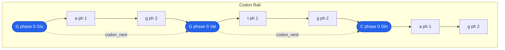

# The ASeq Linked List

At the heart of GenAIRR's C engine is a data structure called **ASeq** (Annotated Sequence). It's a doubly-linked list where each node represents a single nucleotide, and each node carries all the metadata about that nucleotide's origin, identity, and history.

  
The core design principle

  

    Metadata lives <strong>in the nodes</strong>, not in external dictionaries. When you mutate, insert, delete, or corrupt a nucleotide, its metadata moves with it. There are no external arrays to keep in sync, no coordinate offsets to recalculate. The annotations <em>are</em> the sequence.
  

## The Nuc node

Every nucleotide in a simulated sequence is a `Nuc` struct — 44 bytes carrying everything the engine needs to know about that position.

  
Nuc — Annotated Nucleotide Node

  
currentcharThe base right now (A / C / G / T / N)

  
germlinecharOriginal germline base ('\0' for NP-region nodes)

  
segmentSegmentV, NP1, D, NP2, J, C, UMI, or ADAPTER

  
germline_posuint16Position within the germline allele sequence

  
flagsuint16Bitmask of events (mutated, error, anchor, ...)

  

  
prev*Nuc← previous node in the doubly-linked list

  
next*Nuc→ next node in the doubly-linked list

  

  
frame_phaseuint80, 1, or 2 — position within reading frame

  
amino_acidcharTranslated amino acid (phase-0 nodes only)

  
codon_next*NucSkip pointer → next phase-0 node (codon rail)

  
productiveboolFalse if part of a stop codon or broken anchor

### Primary fields

**`current`** — the base as it exists right now. This starts as the germline base but can be changed by SHM, PCR errors, sequencing errors, or N-insertion. This is what ends up in the output `sequence` field.

**`germline`** — the original germline base, frozen at assembly time. This field is **never modified** after initial assignment (with one narrow exception: D-inversion and receptor revision update it because they change the germline reference itself). For NP-region nodes, germline is `'\0'` because these bases have no germline origin. This is what ends up in the `germline_alignment` field.

**`segment`** — which segment this nucleotide belongs to. The segment tag is permanent — it never changes. Even after 5' corruption removes the first 20 V nodes, the remaining V nodes still know they're V.

  SEG_V
  SEG_NP1
  SEG_D
  SEG_NP2
  SEG_J
  SEG_C
  SEG_UMI
  SEG_ADAPTER

**`germline_pos`** — the position of this base within the germline allele sequence. For a V allele like `IGHVF10-G50*04`, germline_pos tells you exactly which base of that allele this node represents. At serialization, the engine reads the germline_pos of the first and last V nodes to compute `v_germline_start` and `v_germline_end` — no counting needed.

### Event flags

The `flags` field is a bitmask tracking everything that has happened to this nucleotide. Flags accumulate — a node can be both `MUTATED` and `SEQ_ERROR` if an SHM mutation was later hit by a sequencing error.

  MUTATED
  SEQ_ERROR
  PCR_ERROR
  P_NUCLEOTIDE
  N_NUCLEOTIDE
  IS_N
  ANCHOR
  INDEL_INS

| Flag | Bit | Set by |
|------|-----|--------|
| `MUTATED` | 0 | S5F somatic hypermutation |
| `SEQ_ERROR` | 1 | Position-dependent sequencing errors |
| `PCR_ERROR` | 2 | PCR polymerase errors |
| `P_NUCLEOTIDE` | 3 | Palindromic nucleotide at junction |
| `N_NUCLEOTIDE` | 4 | TdT-generated N-nucleotide (NP region) |
| `IS_N` | 5 | Base corrupted to ambiguous N |
| `ANCHOR` | 6 | Conserved anchor (V-Cys or J-Trp/Phe) |
| `INDEL_INS` | 7 | Inserted by indel operation |

The serialization code uses these flags to separate mutations, PCR errors, and sequencing errors into their respective output fields — a clean separation that requires no post-hoc heuristics.

## A sequence as a linked list

Here's what a real assembled sequence looks like as an ASeq. Each box is a Nuc node, colored by segment:

  

    Segment
    V V V V V V V V V
     
    N N N N
     
    D D D D D
     
    N N N
     
    J J J J J J
  

  

    Current
    g a g g t g c a g
     
    T G T C
     
    a t a t t
     
    T T A
     
    a c t a c t
  

  

    Germline
    g a g g t g c a g
     
    ∅ ∅ ∅ ∅
     
    a t a t t
     
    ∅ ∅ ∅
     
    a c t a c t
  

  

    Germline Pos
    0 1 2 3 4 5 6 7 8
     
    - - - -
     
    3 4 5 6 7
     
    - - -
     
    9 . . . . .
  

NP nodes have `germline = '\0'` (shown as ∅) and no germline position — they were created by random nucleotide generation, not copied from an allele.

### After SHM mutation

When S5F mutates position 6 (V node, `c` → `T`), only that one node changes:

  

    Current
    g a g g t g T a g
     
    T G T C
     ...
  

  

    Germline
    g a g g t g c a g
     
    ∅ ∅ ∅ ∅
     ...
  

  

    Flags
    · · · · · · M · ·
     
    N N N N
     ...
  

The `germline` field still shows `c`. The `flags` field now has `MUTATED` set. At serialization, this produces the mutation string entry `6:c>T`.

## The ASeq container

  
ASeq — Annotated Sequence Container

  
pool[1024]Nuc[]Pre-allocated arena for all nodes (no malloc)

  
pool_usedintNext free slot in the pool

  

  
head / tail*NucFirst and last nodes in the linked list

  
lengthintNumber of active (linked) nodes

  

  
seg_first[8]*Nuc[]First node of each segment — O(1) boundary access

  
seg_last[8]*Nuc[]Last node of each segment — O(1) boundary access

  

  
codon_rail_validboolIs the codon rail current?

  
n_stop_codonsintLive count — updated on every mutation

  
v_anchor_node*NucCached conserved Cys (junction start)

  
j_anchor_node*NucCached conserved W/F (junction end)

### Arena allocation

All Nuc nodes come from a contiguous `pool[1024]` array — no `malloc` per node. This gives cache-friendly allocation and zero-cost cleanup (just reset `pool_used` to 0). The maximum sequence length of 1024 nucleotides is more than enough for any immunoglobulin or TCR sequence.

### Segment boundary cache

`seg_first[8]` and `seg_last[8]` cache the first and last node of each segment type, giving O(1) access to any segment boundary. These are automatically maintained by all insert/delete operations. When serializing, the engine reads `seg_first[SEG_V]` to find where V starts — no scanning needed.

## The codon rail

The codon rail is a secondary structure overlaid on the nucleotide list. It tracks the reading frame and provides **O(1) amino acid updates** on point mutations.

After assembly, `aseq_build_codon_rail()` walks the entire list, assigning each node a `frame_phase` (0, 1, 2, repeating). Phase-0 nodes are **codon heads** — they hold the translated amino acid and link to the next phase-0 node via `codon_next` skip pointers.

### O(1) mutation updates

When `aseq_mutate()` changes a base, it doesn't retranslate the entire sequence. It:

1. Finds the codon head for the mutated node (walk back 0-2 nodes using `frame_phase`)
2. Retranslates just that one codon (3 bases → 1 amino acid)
3. Updates `n_stop_codons` if the amino acid changed to/from `*`

This means checking productivity after a mutation is effectively free.

### Frame shift propagation

Insertions and deletions shift the reading frame for all downstream nodes. The engine walks forward from the insertion/deletion point, reassigning `frame_phase` and retranslating each affected codon. For batch operations (5'/3' corruption), the codon rail is rebuilt once from scratch instead of propagating individually.

## Operations

Every pipeline step manipulates the ASeq through a small set of primitives:

| Operation | What it does | Metadata effect | Cost |
|-----------|-------------|----------------|------|
| `aseq_mutate()` | Change `current`, set flag | `germline` untouched, 1 codon retranslated | O(1) |
| `aseq_revert()` | Restore `current` to `germline` | Clear `MUTATED` flag, retranslate codon | O(1) |
| `aseq_insert_after()` | Splice new node into list | New node gets `germline='\0'`, propagate frame shift | O(n) |
| `aseq_delete()` | Unlink node from list | Node vanishes with its metadata, propagate frame | O(n) |
| `aseq_delete_head_n()` | Batch remove from 5' end | Rebuild codon rail once | O(n) |
| `aseq_delete_tail_n()` | Batch remove from 3' end | Rebuild codon rail once | O(n) |
| `aseq_reverse_complement()` | Reverse list + complement bases | Flags preserved, codon rail invalidated | O(n) |

  
Why this design works

  

    In many simulators, the sequence is a flat string and annotations live in parallel arrays. Every mutation requires updating these external structures — a constant source of bugs. In GenAIRR, there's nothing to synchronize. When you delete a node, its metadata disappears with it. When you mutate a node, the germline field is untouched. The engine can apply 10+ pipeline steps and still produce metadata that matches the sequence at every position — because the metadata was never separated from the sequence in the first place.
  

