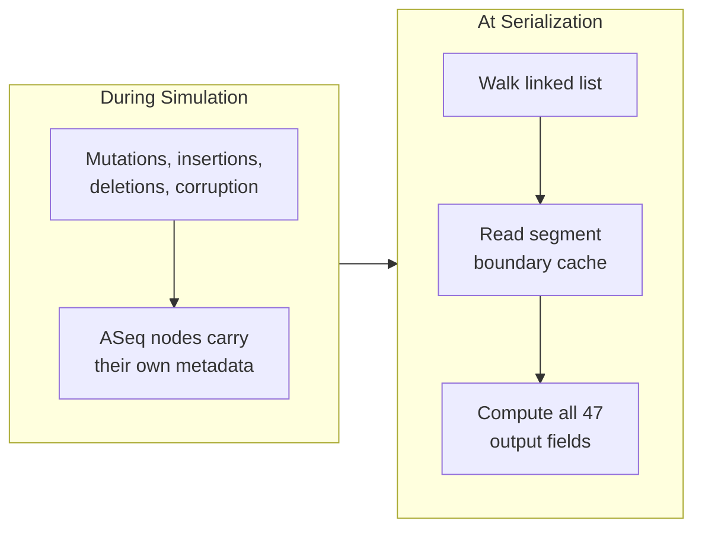
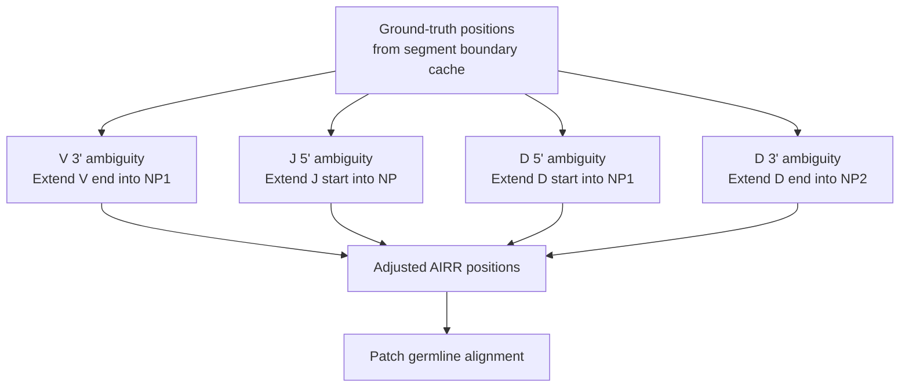

# Metadata Accuracy

GenAIRR's output contains 47 fields, and every one of them must be consistent with the actual sequence. If the V gene ends at position 294, then `v_sequence_end` must be 294. If there are 19 SHM mutations, then `n_mutations` must be 19 and the `mutations` string must list exactly 19 entries. If the junction starts at the conserved Cysteine, then `junction_start` must point to that exact position in the final sequence.

This page explains how the C engine achieves this — and how it handles the edge cases that make this hard.

<div className="callout-card">
  <div className="cc-title">The invariant</div>
  <div className="cc-body">
    Every annotation field is derived from the ASeq linked list at serialization time. The ASeq is always correct because metadata lives <strong>in the nodes</strong>, and nodes are only modified through operations that preserve metadata consistency. There are no stale caches, no coordinate drift, no string buffers that fall out of sync.
  </div>
</div>

## Coordinates are derived, not stored

GenAIRR does not store coordinate fields during simulation. It stores the **ASeq linked list** with segment-tagged nodes. All coordinate fields (`v_sequence_start`, `d_sequence_end`, `junction_start`, etc.) are **derived at serialization time** by walking the linked list.



<div className="callout-card">
  <div className="cc-title">Why this design matters</div>
  <div className="cc-body">
    If coordinates were stored and updated incrementally, every mutation, insertion, deletion, and corruption would need to adjust them — a constant source of bugs. Instead, coordinates are computed once from the final state of the linked list, which is always correct because each node carries its own segment identity.
  </div>
</div>

### How positions are computed

At serialization time, `airr_derive_positions()` reads the segment boundary cache:

<div className="node-diagram">
  <div className="nd-title">Position Derivation — Segment Boundary Cache</div>
  <div className="nd-field"><span className="nd-name">v_sequence_start</span><span className="nd-type">int</span><span className="nd-desc">position_of(seg_first[SEG_V]) — 0-based from head</span></div>
  <div className="nd-field"><span className="nd-name">v_sequence_end</span><span className="nd-type">int</span><span className="nd-desc">position_of(seg_last[SEG_V]) + 1 — exclusive end</span></div>
  <div className="nd-field"><span className="nd-name">v_germline_start</span><span className="nd-type">int</span><span className="nd-desc">seg_first[SEG_V]→germline_pos — position in allele</span></div>
  <div className="nd-field"><span className="nd-name">v_germline_end</span><span className="nd-type">int</span><span className="nd-desc">seg_last[SEG_V]→germline_pos + 1 — exclusive end</span></div>
</div>

The `position_of()` function counts nodes from the head — an O(n) operation, but it only runs once per segment during serialization. Since each node knows its `germline_pos`, the germline coordinates are read directly from the first and last nodes of each segment.

### Coordinates stay correct through any transformation

<div className="seq-vis">
  <div><span className="sv-label">After assembly</span><span className="sv-v">GAGGTGCAGCTGGTG...AGCTGTCAA</span><span className="sv-np">CCGTA</span><span className="sv-d">GTAT</span><span className="sv-np">TACCG</span><span className="sv-j">ACTACTGGTAC</span></div>
  <div><span className="sv-label">v_start = 0</span></div>
</div>

<div className="seq-vis">
  <div><span className="sv-label">After 5' loss</span><span className="sv-v">GCTGTCAA</span><span className="sv-np">CCGTA</span><span className="sv-d">GTAT</span><span className="sv-np">TACCG</span><span className="sv-j">ACTACTGGTAC</span></div>
  <div><span className="sv-label">v_start = 0</span> <span style={{opacity:0.5}}>(first surviving V node is now the head)</span></div>
</div>

<div className="seq-vis">
  <div><span className="sv-label">After UMI prepend</span><span className="sv-umi" style={{color:'var(--gene-np)'}}>ATCGATCGATCG</span><span className="sv-v">GCTGTCAA</span><span className="sv-np">CCGTA</span><span className="sv-d">GTAT</span><span className="sv-np">TACCG</span><span className="sv-j">ACTACTGGTAC</span></div>
  <div><span className="sv-label">v_start = 12</span> <span style={{opacity:0.5}}>(position_of counts past 12 UMI nodes)</span></div>
</div>

- If 5' corruption deleted 20 V nodes, `seg_first[SEG_V]` now points to the 21st V node. `position_of()` counts from the new head, giving the correct offset.
- If an indel inserted 3 bases in the middle of D, `seg_last[SEG_D]` still points to the last D node. The D segment is now 3 bases longer, and `d_sequence_end` reflects this.
- If a UMI was prepended, `position_of(seg_first[SEG_V])` counts past the UMI nodes, so `v_sequence_start = 12` instead of 0.

## The germline alignment

The `germline_alignment` field is a character-by-character encoding of each position's relationship to the germline:

<div className="seq-vis">
  <div><span className="sv-label">sequence</span><span className="sv-v">gaggtgcag</span><span className="sv-mut">T</span><span className="sv-v">tggtggagt</span><span className="sv-v">...</span><span className="sv-np">NNNNNNNNN</span><span className="sv-v">...</span><span className="sv-j">actactgg</span></div>
  <div><span className="sv-label">germline_alignment</span><span className="sv-v">gaggtgcag</span><span className="sv-v">c</span><span className="sv-v">tggtggagt</span><span className="sv-v">...</span><span className="sv-n">NNNNNNNNN</span><span className="sv-v">...</span><span className="sv-j">actactgg</span></div>
  <div><span className="sv-label"></span><span style={{opacity:0.5}}>         ↑ SHM (c→T)              ↑ NP region</span></div>
</div>

### How it's built

`build_germline_alignment()` walks the linked list from head to tail. For each node:

| Node type | Has germline? | Output |
|-----------|:------------:|--------|
| <span className="seg-chip seg-v">V</span> <span className="seg-chip seg-d">D</span> <span className="seg-chip seg-j">J</span> | Yes | The germline base |
| <span className="seg-chip seg-np">NP1</span> <span className="seg-chip seg-np">NP2</span> | No (`'\0'`) | `N` |
| <span className="seg-chip seg-umi">UMI</span> <span className="seg-chip seg-adp">ADAPTER</span> | No | `N` |
| Indel-inserted node | No (`'\0'`) | `N` |

The germline alignment always shows the **original** germline base, regardless of what happened to `current`. If position 9 was originally `c` (germline) and was mutated to `T` (SHM), the germline alignment shows `c` and the sequence shows `T`. This lets you reconstruct the pre-mutation sequence by reading the germline alignment, and identify mutations by comparing it to the sequence.

## Mutation and error strings

The `mutations`, `pcr_errors`, and `sequencing_errors` fields record every event as a comma-separated string:

```
51:c>T,57:c>G,81:a>T,99:a>G
```

Each entry is `position:germline>mutant`, where:
- **Position** is 0-based into the final `sequence` string
- **Germline base** is lowercase (what the base was before the event)
- **Mutant base** is uppercase (what it was changed to)

### How they're built

`build_mutation_annotation()` walks the linked list and checks each node's flags:

| Flag | Appended to |
|------|-------------|
| <span className="flag-badge">MUTATED</span> | `mutations` string |
| <span className="flag-badge">SEQ_ERROR</span> | `sequencing_errors` string |
| <span className="flag-badge">PCR_ERROR</span> | `pcr_errors` string |

The position is the node's offset from the head (computed during the walk). The germline base comes from `node->germline`, and the mutant base from `node->current`.

Counts (`n_mutations`, `n_pcr_errors`, `n_sequencing_errors`) are tallied during the same walk. The mutation rate is computed as `n_mutations / total_germline_positions`.

### Separation of concerns

Because each event type has its own flag bit, they never interfere:
- A position with SHM mutation (<span className="flag-badge">MUTATED</span>) appears only in `mutations`
- A position with a PCR error (<span className="flag-badge">PCR_ERROR</span>) appears only in `pcr_errors`
- A position with both flags would appear in both strings — but this is rare and correct (it means the base was mutated by SHM, then hit by a PCR error)

## Boundary ambiguity resolution

This is the most subtle part of metadata accuracy. After V(D)J recombination, the boundaries between gene segments and NP regions can be ambiguous.

### The problem

Consider a V allele trimmed by 3 bases at its 3' end. The last 3 bases of the full V allele were `AGC`. The NP1 region (random nucleotides) happens to start with `AGC`:

<div className="seq-vis">
  <div><span className="sv-label">True biology</span><span className="sv-v">...GCTGTC</span><span style={{opacity:0.3,color:'var(--gene-v)'}}>AGC</span><span className="sv-np">AGC</span><span className="sv-np">TA</span><span className="sv-d">GTAT</span><span className="sv-np">TACCG</span><span className="sv-j">ACTACTGG</span></div>
  <div><span className="sv-label"></span><span style={{opacity:0.5}}>              ↑↑↑  ↑↑↑</span></div>
  <div><span className="sv-label"></span><span style={{opacity:0.5}}>           trimmed  NP1 (happens to match)</span></div>
</div>

<div className="seq-vis">
  <div><span className="sv-label">What an aligner sees</span><span className="sv-v">...GCTGTCAGC</span><span className="sv-np">TA</span><span className="sv-d">GTAT</span><span className="sv-np">TACCG</span><span className="sv-j">ACTACTGG</span></div>
  <div><span className="sv-label"></span><span style={{opacity:0.5}}>              ↑↑↑</span></div>
  <div><span className="sv-label"></span><span style={{opacity:0.5}}>           extended into V (ambiguous bases)</span></div>
</div>

An aligner can't tell where V ends and NP1 begins — the `AGC` could be either. Aligners resolve this by extending V into NP1. GenAIRR replicates this behavior so its annotations match what you'd get from IgBLAST or IMGT/V-QUEST.

### How it works

After computing ground-truth positions from segment boundaries, `airr_derive_positions()` runs four boundary checks:



For each boundary:
1. Compare the trimmed allele bases to the adjacent NP bases
2. For each matching base, extend the segment boundary by 1
3. Stop at the first non-matching base

This produces the exact same boundaries an aligner would report.

### Germline alignment patching

After boundary extension, the germline alignment needs patching. The NP bases that were absorbed into V/D/J now need to show the germline allele base instead of `N`:

<div className="seq-vis">
  <div><span className="sv-label">Before patching</span><span className="sv-v">...GCTGTC</span><span className="sv-n">NNN</span><span className="sv-n">NN</span><span className="sv-d">gtat</span><span className="sv-n">NNNNN</span><span className="sv-j">actactgg</span></div>
  <div><span className="sv-label">After patching</span><span className="sv-v">...GCTGTC</span><span className="sv-v">agc</span><span className="sv-n">NN</span><span className="sv-d">gtat</span><span className="sv-n">NNNNN</span><span className="sv-j">actactgg</span></div>
  <div><span className="sv-label"></span><span style={{opacity:0.5}}>              ↑↑↑ absorbed into V, now show V germline bases</span></div>
</div>

If any of these absorbed NP bases differ from the allele base, they are counted as additional mutations and appended to the mutations string. This matches what an aligner would report — "the V gene extends to position X, and there's a mutation at position Y" — even though biologically, position Y was actually an NP base that happened to look like V.

## Junction coordinates

The junction is defined by the IMGT convention: from the conserved Cysteine (V anchor) to the end of the conserved Tryptophan/Phenylalanine codon (J anchor + 3 bases).

<div className="seq-vis">
  <div><span className="sv-label">Full sequence</span><span className="sv-v">...FWR3...</span><span className="sv-v" style={{fontWeight:700,textDecoration:'underline'}}>C</span><span className="sv-v">AA</span><span className="sv-np">CCGTA</span><span className="sv-d">GTAT</span><span className="sv-np">TACCG</span><span className="sv-j">AC</span><span className="sv-j" style={{fontWeight:700,textDecoration:'underline'}}>TGG</span><span className="sv-j">TAC...</span></div>
  <div><span className="sv-label">Junction</span><span style={{opacity:0.3}}>...FWR3...</span><span style={{borderBottom:'2px solid var(--ifm-color-primary)'}}>CAACCGTAGTATTACCGACTGG</span><span style={{opacity:0.3}}>TAC...</span></div>
  <div><span className="sv-label"></span><span style={{opacity:0.5}}>           ↑ V anchor (Cys)                    ↑↑↑ J anchor + 3 (Trp codon)</span></div>
</div>

The engine finds these anchors by checking the <span className="flag-badge">ANCHOR</span> flag on V and J segment nodes. The anchor flag is set during assembly when a node's `germline_pos` matches the allele's known anchor position.

<div className="node-diagram">
  <div className="nd-title">Junction Coordinate Derivation</div>
  <div className="nd-field"><span className="nd-name">junction_start</span><span className="nd-type">int</span><span className="nd-desc">position_of(v_anchor_node) — the conserved Cys</span></div>
  <div className="nd-field"><span className="nd-name">junction_end</span><span className="nd-type">int</span><span className="nd-desc">position_of(j_anchor_node) + 3 — end of Trp/Phe codon</span></div>
  <div className="nd-field"><span className="nd-name">junction_length</span><span className="nd-type">int</span><span className="nd-desc">junction_end − junction_start</span></div>
</div>

### Edge case: 3' corruption

If 3' corruption removes bases past the J anchor, `junction_end` could exceed the sequence length. The engine caps it:

```c
if (junction_end > seq_len) junction_end = seq_len;
```

This means the junction may be truncated in the output, but the coordinates are still valid relative to the actual sequence.

## Allele calls

The `v_call`, `d_call`, and `j_call` fields report the allele names. These come directly from the allele pointers stored in the SimRecord during sampling — they're not derived from alignment.

<div className="callout-card">
  <div className="cc-title">Ground-truth allele identity</div>
  <div className="cc-body">
    GenAIRR always knows the true allele identity, even when trimming is so aggressive that an aligner couldn't determine it. If the V allele was trimmed by 100 bases and only 50 remain, GenAIRR still reports the correct V allele. This is what makes GenAIRR useful for <strong>benchmarking annotation tools</strong> — you know exactly what the right answer is, and you can measure how often the tool gets it right.
  </div>
</div>
