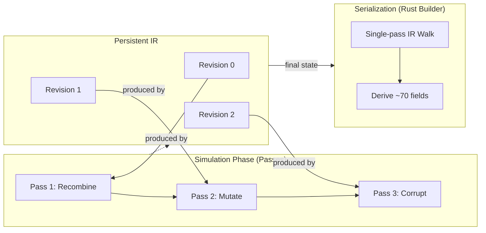

# Metadata Accuracy

GenAIRR's output contains approximately **70 ground-truth fields**, and every one of them must be perfectly consistent with the simulated sequence. If the V gene ends at position 294, then `v_sequence_end` must be 294. If the junction starts at the conserved Cysteine, then `junction_start` must point to that exact position in the final sequence.

This page explains how the new Rust simulation engine achieves absolute ground-truth accuracy through its persistent IR and single-pass serialization architecture.

  
The Invariant

  

    Every annotation field is derived from the <strong>Simulation IR</strong> at serialization time. The IR is always correct because every transformation (Pass) produces a new IR revision that captures the biological or technical effect perfectly. There are no stale caches, no coordinate drift, and no manual string manipulations that can fall out of sync.
  

## Derived, Not Stored

GenAIRR does not store coordinate fields during simulation. Instead, it maintains a persistent **Intermediate Representation (IR)** that tracks:
1.  **Nucleotide Pool:** The actual sequence of bases.
2.  **Regions:** Spans within the pool tagged with segment identities (V, D, J, NP1, NP2).
3.  **Assignments:** Provenance data for each segment (which allele was sampled).

All coordinate fields (`v_sequence_start`, `junction_start`, etc.) and alignment strings are **derived at serialization time** by a single-pass walker that analyzes the final IR state.

### Why This Design Matters
In many simulators, coordinates are stored and updated incrementally. This is a constant source of bugs—every mutation, insertion, or deletion must manually adjust multiple coordinate variables. In GenAIRR, coordinates are computed once from the final state of the IR. Since the IR tracks segment identities and germline origins at the base level, the computed coordinates are mathematically guaranteed to be correct.

## The Single-Pass Walker

The Rust engine uses a sophisticated single-pass walker (`walk_alignment_columns`) to generate the majority of the metadata. As it walks the IR regions, it simultaneously builds:
-   **Sequence Alignment:** The simulated sequence with gaps.
-   **Germline Alignment:** The reference sequence with gaps.
-   **CIGAR Strings:** Compressed alignment operations (M, D, I).
-   **Identities:** Per-segment match percentages.
-   **Coordinate Spans:** Pool, alignment, and germline ranges.

By doing this in a single pass, the engine ensures that the CIGAR string is perfectly in sync with the alignment strings and the sequence coordinates.

## Truth vs. Evidence-Based Calls

One of GenAIRR's most powerful features for benchmarking is the separation of **sampled truth** (provenance) and **evidence-based calls**.

*   **Sampled Truth (`truth_v_call`):** The exact allele the engine chose to start with.
*   **Evidence-Based Call (`v_call`):** The allele the final sequence matches most closely after mutations.

In extreme somatic hypermutation cases, a sequence might diverge so much from its origin that it appears closer to a different allele. GenAIRR allows you to export both, so you can measure how often alignment tools choose the "correct" biological origin versus the "correct" statistical match.

## Junction Coordinates

The junction is defined by the IMGT convention: from the conserved V-anchor (Cysteine) to the end of the conserved J-anchor (Tryptophan or Phenylalanine).

The engine finds these anchors by checking for the specific `germline_pos` within the V and J segments that corresponds to the known anchor position in the reference allele. This ensures that even if the V segment is heavily trimmed at its 5' end or mutated in its framework, the junction coordinates remain accurate.

  
Junction Coordinate Derivation

  
junction_startintPosition of the conserved Cys codon in the sequence

  
junction_endintPosition after the conserved Trp/Phe codon + 3 bases

  
junction_lengthintThe span in nucleotides

## Reproducibility and the Trace

Accuracy is useless if it isn't reproducible. The **Addressed Trace** records every random decision made during simulation.
-   `np.np1.length = 6`
-   `np.np1.bases[0] = b'A'`
-   `mutate.s5f.site[0] = 12`

Because the trace is part of the simulation **Outcome**, you can verify exactly why a specific sequence looks the way it does. This makes GenAIRR results "auditable"—you can trace any output field back to the specific engine decision that produced it.

## Next steps

- [Simulation Pipeline](/docs/concepts/simulation-pipeline) — How the modular pass system works
- [Interpreting Results](/docs/getting-started/interpreting-results) — Detailed reference for all ~70 output fields
