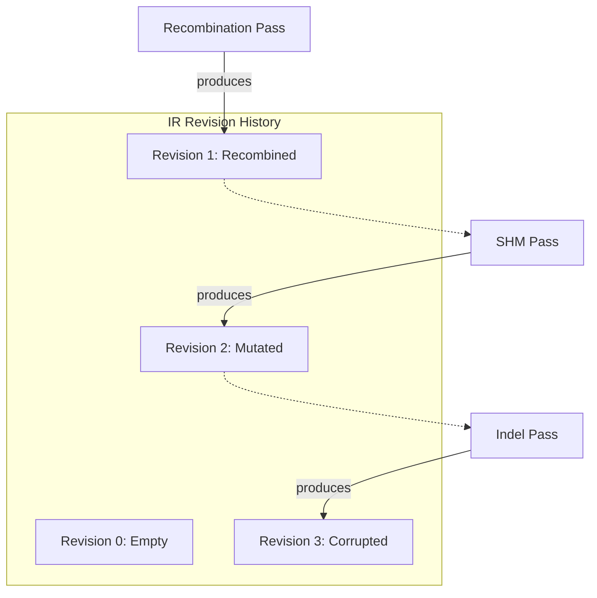

# Persistent IR Architecture

The heart of GenAIRR's high-performance engine is a **Persistent Intermediate Representation (IR)**. This architecture ensures superior performance, guaranteed reproducibility, and a complete history of every simulation.

  
Persistent Data Structures

  

    In functional programming, a <strong>persistent data structure</strong> is one that always preserves its prior state when it is modified. In GenAIRR, every simulation pass produces a <em>new</em> revision of the state, leaving the old one untouched. This ensures that the simulation history is immutable and "audit-ready."
  

## The Nucleotide Pool

Instead of a linked list of scattered nodes, all nucleotides in a GenAIRR sequence are stored in a flat, contiguous **Nucleotide Pool**.

### The Nucleotide Struct

Each nucleotide is an 8-byte structure containing all the metadata needed for absolute ground truth:

| Field | Type | Description |
|-------|------|-------------|
| `base` | `u8` | The current nucleotide (A, C, G, T, N). Uppercase = germline, lowercase = mutated. |
| `germline` | `u8` | The original germline base at this position. |
| `germline_pos`| `u16` | The 0-based index into the source germline allele. |
| `segment` | `enum` | Which biological segment this base belongs to (V, D, J, NP1, NP2). |
| `flags` | `u8` | Bitmask for events: `P_NUC`, `N_NUC`, `JUNCTION`, `INVERTED`, `INDEL_INSERTED`. |

By keeping this structure small and contiguous in memory, the Rust engine achieves incredible cache efficiency, allowing it to process tens of thousands of sequences per second.

## Regions and Assignments

The IR doesn't just store bases; it tracks the structural organization of the sequence through **Regions** and **Assignments**.

*   **Regions:** Define spans within the nucleotide pool (e.g., "Bases 0 to 290 are the V segment").
*   **Assignments:** Track which specific alleles were sampled for the V, D, and J segments.

Because these are decoupled from the raw bases, GenAIRR can perform complex transformations—like replacing a V-segment during receptor revision—by simply updating the region map and the assignments, while the underlying ground-truth metadata remains perfectly intact.

## The Transformation Workflow

When a simulation pass (like Somatic Hypermutation) runs, it follows a **Research → Strategy → Execution** pattern internally:

1.  **Read:** Analyze the current IR revision (e.g., locate the V segment).
2.  **Plan:** Determine which changes to apply (e.g., select 10 mutation sites via S5F).
3.  **Execute:** Produce a *new* IR revision with the changes applied.

## Why This Matters

### 1. Zero-Cost Replays
Because every random choice is recorded in a separate **Trace** and the IR is persistent, GenAIRR can "time travel." You can jump back to any revision in the history or replay the entire simulation from a specific point with bit-for-bit identity.

### 2. "Correct by Construction"
In the old architecture, deleting a base required updating dozens of external pointers and counters. In the new persistent IR, you simply create a new nucleotide pool that omits the base. The metadata is naturally preserved because it's part of the pool itself, and the new revision is isolated from any previous state.

### 3. Benchmarking Ground Truth
Since the IR carries the `germline` base and `germline_pos` for every single nucleotide, the final AIRR record builder can derive CIGAR strings, alignment scores, and mutation lists with 100% accuracy. There is no "alignment" happening inside GenAIRR—only the reporting of what the engine already knows to be true.

## Next steps

- [Simulation Pipeline](/docs/concepts/simulation-pipeline) — How the modular pass system works
- [Metadata Accuracy](/docs/concepts/metadata-accuracy) — How GenAIRR derives ground truth from the IR
