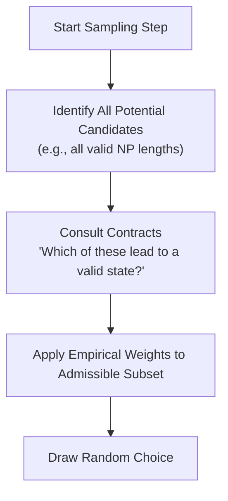

# How Sampling Works

GenAIRR is a **stochastic simulator** that transforms biological reference data into realistic synthetic sequences. This page provides transparency into the internal sampling mechanics of the engine — how it uses the empirical distributions defined in a `DataConfig`.

## 1. Allele Sampling

Each species/chain configuration includes a weighted list of V, D, and J alleles.

*   **Empirical Weights:** Allele frequencies are sourced from the original reference database (IMGT or OGRDB). An allele with a higher frequency in the source population is proportionally more likely to be sampled by GenAIRR.
*   **Uniform Selection:** When you use `.using(v=["A", "B"])`, the engine ignores empirical weights and samples uniformly from the provided list.
*   **Zero-Weight Alleles:** Alleles with a frequency of zero in the reference data are never sampled unless explicitly locked via `.using()`.

## 2. Exonuclease Trimming

Biological V(D)J recombination involves the "nibbling" of segment ends by exonucleases. GenAIRR models this using **Empirical Trimming Distributions**.

*   **Markov Chain Models:** For many species, trimming is modeled as a Markov chain where the probability of nibbling the next base depends on the current position.
*   **Marginalization:** While the reference data often contains per-allele trim models, GenAIRR marginalizes these into segment-level distributions to ensure robust sampling even for rare alleles.
*   **The Anchor Guard:** The engine automatically prevents trimming that would destroy the conserved biological anchors (Cys 104 and Trp/Phe 118) unless the configuration explicitly allows it.

## 3. Junctional Diversity (NP Regions)

Non-templated (N) and Palindromic (P) nucleotides are added between gene segments by the TdT enzyme.

### P-Nucleotides
P-nucleotides are short, palindromic sequences formed when the hairpin loop of a segment is cleaved off-center.
*   GenAIRR uses a geometric decay model for P-nucleotide lengths (typically 0-4 bp).
*   The sequence of P-nucleotides is derived directly from the reverse-complement of the segment end.

### N-Nucleotides (NP1 and NP2)
N-nucleotides are random insertions between segments.
*   **Length Sampling:** Lengths are drawn from species-specific empirical distributions (e.g., Human NP1 lengths typically range from 0 to 20+ bp).
*   **Sequence Composition:** Instead of uniform random noise, GenAIRR uses **transition probability matrices**. These capture the nucleotide bias of the TdT enzyme (e.g., a preference for G/C additions in certain species).

## 4. Somatic Hypermutation (S5F)

The S5F model is a context-dependent substitution model.

*   **Mutability:** Every 5-mer context (e.g., `WRC`) is assigned a mutability score.
*   **Substitution:** Every context also has a substitution profile (the probability of changing to each of the other three bases).
*   **Iterative Re-weighting:** The Rust engine recomputes the 5-mer contexts and their weights after *every single mutation*, ensuring that hot-spot and cold-spot dynamics evolve realistically as mutations accumulate.

## 5. Constraint-Aware Pruning (Contracts)

When a **Contract** (like `productive()`) is active, the sampling process changes from "sample and filter" to **pruned sampling**.

By pruning the search space *before* the draw, GenAIRR ensures that every sequence satisfies the biological requirements without distorting the underlying statistical distributions.

## Next steps

- [Persistent IR](/docs/concepts/persistent-ir) — How the state is stored
- [Simulation Pipeline](/docs/concepts/simulation-pipeline) — The order of operations
- [Metadata Accuracy](/docs/concepts/metadata-accuracy) — How we track these decisions
