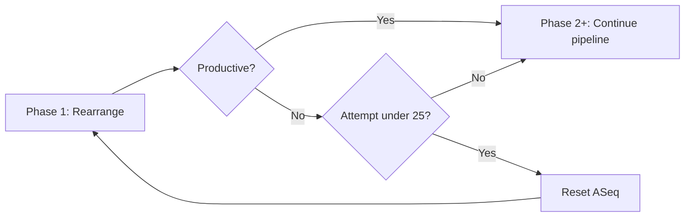
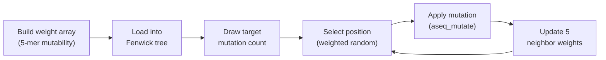
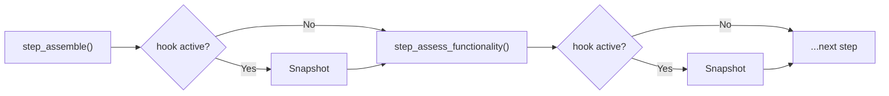

# The Simulation Pipeline

Every GenAIRR sequence passes through a fixed pipeline of steps. Each step receives the same three arguments: the simulation config, the ASeq linked list, and a SimRecord. Each step transforms the ASeq in-place, and the SimRecord accumulates metadata about what happened.

The pipeline is built once at compile time from your DSL ops, then executed once per sequence. Steps that aren't needed (because you didn't enable them) are simply not registered — zero overhead.

## The full pipeline

```mermaid
flowchart TD
    subgraph P1["Phase 1 — Core Rearrangement"]
        direction TB
        sv[sample_v] --> sd[sample_d] --> sj[sample_j] --> sc[sample_c]
        sc --> tv[trim_v] --> td[trim_d] --> tj[trim_j]
        tj --> asm[assemble] --> af[assess_functionality]
    end

    subgraph P2["Phase 2 — Biological Events"]
        direction TB
        di[d_inversion] --> rr[receptor_revision]
    end

    subgraph P3["Phase 3 — Somatic Hypermutation"]
        direction TB
        s5f[s5f_mutate]
    end

    subgraph P4["Phase 4 — Post-Mutation"]
        direction TB
        sp[selection_pressure]
    end

    subgraph P5["Phase 5 — Corruption"]
        direction TB
        pm[primer_mask] --> umi[simulate_umi] --> pcr[pcr_amplification]
        pcr --> qe[quality_errors] --> rc[reverse_complement] --> cont[spike_contaminants]
        cont --> c5[corrupt_5_prime] --> c3[corrupt_3_prime]
        c3 --> ind[insert_indels] --> ins[insert_ns] --> ttl[trim_to_length]
    end

    subgraph P6["Phase 6 — Serialization"]
        direction TB
        ser[airr_serialize]
    end

    P1 --> P2 --> P3 --> P4 --> P5 --> P6

    af -. "retry boundary\n(productive=True)" .-> sv
```



<div className="callout-card">
  <div className="cc-title">Only enabled steps run</div>
  <div className="cc-body">
    The pipeline is an array of function pointers populated at compile time. If you didn't enable a feature (e.g. <code>with_indels()</code>), its step function is never registered — there's no conditional check at runtime, just a shorter array.
  </div>
</div>

## Phase 1: Core rearrangement

<div className="pipeline-phase">
  <div className="phase-title">Phase 1 — Core Rearrangement</div>
  <div className="phase-steps">
    <span className="step-tag">sample_v</span>
    <span className="step-tag">sample_d</span>
    <span className="step-tag">sample_j</span>
    <span className="step-tag">sample_c</span>
    <span className="step-tag">trim_v</span>
    <span className="step-tag">trim_d</span>
    <span className="step-tag">trim_j</span>
    <span className="step-tag">assemble</span>
    <span className="step-tag">assess_functionality</span>
  </div>
</div>

This is the only mandatory phase — it always runs. It builds the raw rearranged sequence.

### Allele sampling

`step_sample_v`, `step_sample_d`, `step_sample_j` each draw an allele from the config's weighted allele pool. The weight of each allele reflects its empirical frequency in the reference database. When `using()` is active, sampling is restricted to the specified allele(s).

### Trimming

Exonuclease nibbling removes bases from the ends of each gene segment. `step_trim_v` draws 5' and 3' trim amounts from the config's trimming distributions (Markov chain-based). `step_trim_d` and `step_trim_j` do the same for their segments.

Trimming doesn't modify the ASeq yet — it just records the trim amounts in the SimRecord. The actual removal happens during assembly.

### Assembly

`step_assemble` is where the ASeq linked list is actually built:

<div className="seq-vis">
  <div><span className="sv-label">Step 1</span><span className="sv-v">GAGGTGCAGCTGGTG...AGC</span> <span style={{opacity:0.5}}>← trimmed V</span></div>
  <div><span className="sv-label">Step 2</span><span className="sv-v">GAGGTGCAGCTGGTG...AGC</span><span className="sv-np">CCGTA</span> <span style={{opacity:0.5}}>← + NP1</span></div>
  <div><span className="sv-label">Step 3</span><span className="sv-v">GAGGTGCAGCTGGTG...AGC</span><span className="sv-np">CCGTA</span><span className="sv-d">GTAT</span> <span style={{opacity:0.5}}>← + trimmed D</span></div>
  <div><span className="sv-label">Step 4</span><span className="sv-v">GAGGTGCAGCTGGTG...AGC</span><span className="sv-np">CCGTA</span><span className="sv-d">GTAT</span><span className="sv-np">TACCG</span> <span style={{opacity:0.5}}>← + NP2</span></div>
  <div><span className="sv-label">Step 5</span><span className="sv-v">GAGGTGCAGCTGGTG...AGC</span><span className="sv-np">CCGTA</span><span className="sv-d">GTAT</span><span className="sv-np">TACCG</span><span className="sv-j">ACTACTGGTAC</span> <span style={{opacity:0.5}}>← + trimmed J</span></div>
</div>

For each step:

1. **Appends the trimmed V** — takes the V allele sequence from position `v_trim_5` to `length - v_trim_3`, creates one Nuc node per base, each tagged <span className="seg-chip seg-v">SEG_V</span> with the correct `germline_pos`. If the allele has a conserved anchor (Cys at position ~104), the corresponding node gets <span className="flag-badge">ANCHOR</span>.

2. **Generates NP1** — creates random nucleotides (uniform ACGT), tagged <span className="seg-chip seg-np">SEG_NP1</span> with `germline = '\0'` (no germline origin). Length is drawn from the config's NP length distribution.

3. **Appends the trimmed D** (VDJ chains only) — same as V but tagged <span className="seg-chip seg-d">SEG_D</span>, no anchor.

4. **Generates NP2** (VDJ chains only) — random nucleotides tagged <span className="seg-chip seg-np">SEG_NP2</span>.

5. **Appends the trimmed J** — tagged <span className="seg-chip seg-j">SEG_J</span>, anchor at the conserved Trp/Phe position.

After assembly, the ASeq is a complete linked list with every node carrying its segment identity and germline position.

### Functionality assessment

`step_assess_functionality` builds the codon rail (assigning frame phases and translating all codons) and runs the 5-rule productivity validator. This determines `productive`, `vj_in_frame`, and `stop_codon`. See the [Productive Sequences](/docs/guides/options/productive) guide for details on the five rules.

### The retry boundary



When `productive=True`, the pipeline sets a retry boundary right after `step_assess_functionality`. If the rearrangement isn't productive, the pipeline resets the ASeq and repeats Phase 1 from scratch (up to 25 attempts). Only Phase 1 is retried — all subsequent phases run exactly once on the final rearrangement.

## Phase 2: Biological events

<div className="pipeline-phase phase-bio">
  <div className="phase-title">Phase 2 — Biological Events</div>
  <div className="phase-steps">
    <span className="step-tag">d_inversion</span>
    <span className="step-tag">receptor_revision</span>
  </div>
</div>

These steps modify the assembled sequence before mutation. They are rearrangement-level events.

**D-gene inversion** reverse-complements only the <span className="seg-chip seg-d">SEG_D</span> nodes. Both `current` and `germline` are updated because the germline reference for this sequence is now the reverse complement of the D allele.

**Receptor revision** replaces the upstream portion of <span className="seg-chip seg-v">SEG_V</span> with a different allele's sequence, preserving a short footprint at the V-D junction. Both `current` and `germline` are updated to the new allele's bases.

## Phase 3: Somatic hypermutation

<div className="pipeline-phase phase-mutate">
  <div className="phase-title">Phase 3 — Somatic Hypermutation</div>
  <div className="phase-steps">
    <span className="step-tag">s5f_mutate</span>
  </div>
</div>

S5F mutation is called by the API layer outside the pipeline executor (because it needs access to the S5F model data, which lives on the simulator object, not in the SimConfig). But conceptually it's Phase 3.

The S5F engine works in five steps:



1. **Build weight array** — for each mutable position (<span className="seg-chip seg-v">V</span>, <span className="seg-chip seg-d">D</span>, <span className="seg-chip seg-j">J</span> nodes only — not NP), compute the 5-mer context and look up its mutability score
2. **Load into Fenwick tree** — O(log N) weighted random selection
3. **Draw target count** — from the configured mutation rate range
4. **Select + mutate** — pick a position, pick a substitution base (weighted by the 5-mer's substitution profile), call `aseq_mutate()`
5. **Update weights** — recalculate the 5 affected positions (mutated position ± 2)

Each call to `aseq_mutate()` automatically retranslates the affected codon and updates the stop codon count. If productive mode is active, it avoids mutations that would introduce stop codons or destroy conserved anchors.

<div className="seq-vis">
  <div><span className="sv-label">Before SHM</span><span className="sv-v">gaggtgcagctggtggagtctgg</span><span className="sv-np">ccgta</span><span className="sv-d">gtat</span></div>
  <div><span className="sv-label">After SHM</span><span className="sv-v">gaggtgcag</span><span className="sv-mut">T</span><span className="sv-v">tggtg</span><span className="sv-mut">C</span><span className="sv-v">agt</span><span className="sv-mut">A</span><span className="sv-v">tgg</span><span className="sv-np">ccgta</span><span className="sv-d">gtat</span></div>
  <div><span className="sv-label">Flags changed</span><span className="sv-v">·········</span><span className="sv-mut">M</span><span className="sv-v">·····</span><span className="sv-mut">M</span><span className="sv-v">···</span><span className="sv-mut">M</span><span className="sv-v">···</span><span className="sv-np">·····</span><span className="sv-d">····</span></div>
</div>

NP regions are never mutated — they have no germline origin, so S5F 5-mer contexts don't apply.

## Phase 4: Post-mutation

<div className="pipeline-phase phase-bio">
  <div className="phase-title">Phase 4 — Post-Mutation</div>
  <div className="phase-steps">
    <span className="step-tag">selection_pressure</span>
  </div>
</div>

**Selection pressure** walks all mutated <span className="seg-chip seg-v">V</span>-segment nodes and classifies each mutation as replacement (R) or silent (S) by comparing the codon's amino acid before and after. Silent mutations are always kept. Replacement mutations are accepted or rejected based on their IMGT region (CDR vs FWR) and the configured acceptance probabilities. Rejected mutations are reverted via `aseq_revert()`, which restores the germline base and clears the <span className="flag-badge">MUTATED</span> flag.

## Phase 5: Corruption

<div className="pipeline-phase phase-corrupt">
  <div className="phase-title">Phase 5 — Corruption (Wet-Lab Artifacts)</div>
  <div className="phase-steps">
    <span className="step-tag">primer_mask</span>
    <span className="step-tag">simulate_umi</span>
    <span className="step-tag">pcr_amplification</span>
    <span className="step-tag">quality_errors</span>
    <span className="step-tag">reverse_complement</span>
    <span className="step-tag">spike_contaminants</span>
    <span className="step-tag">corrupt_5_prime</span>
    <span className="step-tag">corrupt_3_prime</span>
    <span className="step-tag">insert_indels</span>
    <span className="step-tag">insert_ns</span>
    <span className="step-tag">trim_to_length</span>
  </div>
</div>

These steps simulate wet-lab artifacts. They modify the ASeq in ways that can be destructive — removing nodes, adding non-biological nodes, changing bases with different error profiles.

<div className="callout-card">
  <div className="cc-title">Why metadata survives corruption</div>
  <div className="cc-body">
    Every corruption operation uses the same ASeq mutation/insertion/deletion primitives. When 5' corruption deletes 20 V nodes, those nodes and their metadata simply vanish from the list. The remaining V nodes still know they're V nodes with correct germline positions. There are no external coordinate arrays to update.
  </div>
</div>

### Operation order

The corruption steps run in a fixed order that mirrors the real experimental workflow:

| Order | Step | Simulates | Effect on ASeq |
|:-----:|------|-----------|----------------|
| 1 | `primer_mask` | Library prep | Reverts <span className="flag-badge">MUTATED</span> flags in FR1 |
| 2 | `simulate_umi` | Library prep | Prepends <span className="seg-chip seg-umi">UMI</span> nodes |
| 3 | `pcr_amplification` | Amplification | Sets <span className="flag-badge">PCR_ERROR</span> across all positions |
| 4 | `quality_errors` | Sequencing | Sets <span className="flag-badge">SEQ_ERROR</span> position-dependently |
| 5 | `reverse_complement` | Sequencing | Reverses list order, complements all bases |
| 6 | `spike_contaminants` | Contamination | May replace entire sequence |
| 7 | `corrupt_5_prime` | Signal loss | Removes/adds nodes at head |
| 8 | `corrupt_3_prime` | Signal loss | Removes/adds nodes at tail |
| 9 | `insert_indels` | Post-processing | Inserts/deletes nodes at random positions |
| 10 | `insert_ns` | Base-calling failure | Replaces bases with N, sets <span className="flag-badge">IS_N</span> |

`trim_to_length` always runs last if a max sequence length is configured.

## Phase 6: Serialization

<div className="pipeline-phase phase-serial">
  <div className="phase-title">Phase 6 — Serialization</div>
  <div className="phase-steps">
    <span className="step-tag">airr_serialize</span>
  </div>
</div>

`airr_serialize()` walks the final ASeq one last time and derives every AIRR output field. See [Metadata Accuracy](/docs/concepts/metadata-accuracy) for the details of how this works.

## Pipeline as a function array

Internally, the pipeline is just an array of function pointers:

<div className="node-diagram">
  <div className="nd-title">Pipeline — Step Execution Engine</div>
  <div className="nd-field"><span className="nd-name">steps[64]</span><span className="nd-type">StepFn[]</span><span className="nd-desc">Registered step function pointers</span></div>
  <div className="nd-field"><span className="nd-name">hook_ids[64]</span><span className="nd-type">int[]</span><span className="nd-desc">Hook point ID per step (-1 = no hook)</span></div>
  <div className="nd-field"><span className="nd-name">n_steps</span><span className="nd-type">int</span><span className="nd-desc">Number of registered steps</span></div>
  <div className="nd-field"><span className="nd-name">retry_boundary</span><span className="nd-type">int</span><span className="nd-desc">Index for productive retry (-1 = disabled)</span></div>
</div>

`pipeline_build()` populates the `steps` array based on which features are enabled. `pipeline_execute()` iterates through the array and calls each function. This design makes the pipeline zero-overhead — only enabled steps are called, with no conditional checks at runtime.

```c
typedef void (*StepFn)(const SimConfig *, ASeq *, SimRecord *);
```

Every step has the same signature. The engine doesn't know or care what any step does — it just calls them in order. This makes adding new steps trivial: write the function, register it at the right position in `pipeline_build()`.

## Hook points

The pipeline supports snapshot hooks for introspection. After each step that has a `hook_id >= 0`, the executor checks if that hook is active (via a bitmask). If so, it copies the entire ASeq and SimRecord into a snapshot buffer.



This lets you inspect the sequence at any stage — for example, comparing the state before and after S5F mutation to see exactly which positions were changed.

<div className="callout-card">
  <div className="cc-title">Zero overhead when disabled</div>
  <div className="cc-body">
    The hook check is a single integer AND operation: <code>hook_mask & (1u &lt;&lt; hook_id)</code>. When no hooks are set (<code>hook_mask = 0</code>), the check is always false and no snapshots are taken. There is no performance cost for having the hook system in the pipeline.
  </div>
</div>
