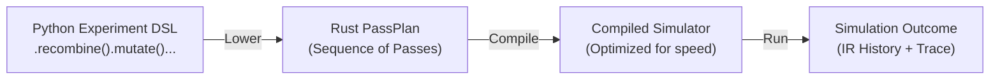
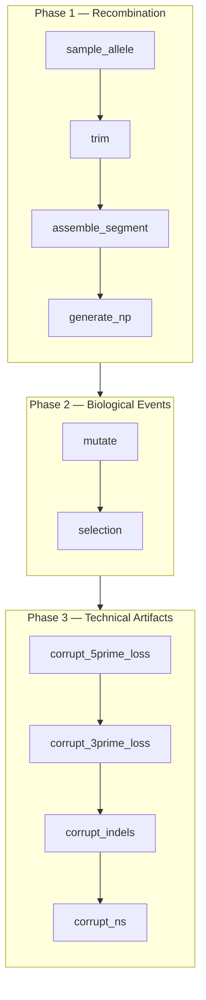

# The Simulation Pipeline

In GenAIRR, a simulation is defined as an ordered sequence of **Passes**. Each pass is a discrete biological or technical transformation that takes the current state of the simulation and produces a new, updated state.

GenAIRR uses a flexible **PassPlan** architecture. This allows you to compose complex, multi-stage experiments where every step is tracked, reproducible, and reversible.

## Architecture: Persistent IR and Traces

The simulation engine is built on two core pillars:

1.  **Persistent IR (Intermediate Representation):** The state of a sequence (nucleotide pool, segment assignments, regions) is stored in an immutable data structure. Each pass produces a *new* revision of the state without mutating the previous one. This provides a complete **History** of the simulation's lifecycle.
2.  **Addressed Trace:** Every random choice made by the engine—from allele sampling to mutation site selection—is recorded in a hierarchical log. These choices are keyed by "addresses" (e.g., `np.np1.length`), enabling exact replay and deep introspection.

## From DSL to Execution

When you use the fluent `Experiment` API in Python, you are building a recipe that the engine "lowers" into a compiled execution plan:

## The Modular Pipeline

The engine breaks down complex biological events into modular passes. A typical V(D)J recombination experiment is composed of these primary phases:

### Phase 1: Recombination
This phase builds the initial rearranged sequence. In the new engine, this is highly granular:
*   **`sample_allele`**: Draws V, D, and J alleles from the reference pool.
*   **`trim`**: Determines the exonuclease nibbling lengths for segment ends.
*   **`assemble_segment`**: Physically appends the trimmed segment bases to the sequence.
*   **`generate_np`**: Inserts non-templated nucleotides between segments.

### Phase 2: Biological Events
This phase introduces post-recombination biological variation:
*   **`mutate`**: Applies somatic hypermutation (SHM) using models like S5F or uniform substitution.
*   **`selection`**: (Optional) Filters mutations based on their impact (Replacement vs. Silent) in specific IMGT regions.

### Phase 3: Technical Artifacts (Corruption)
Models the noise introduced by library prep and sequencing:
*   **End Loss**: Simulates primer trimming or signal degradation at sequence ends.
*   **Indels/Ns**: Adds sequencing-induced insertions, deletions, or ambiguous base calls.
*   **PCR Noise**: Introduces errors that mimic amplification bias.

## Constraint-Aware Sampling (Contracts)

A signature feature of the new engine is **Constraint-Aware Sampling**. Instead of generating a sequence and "retrying" if it doesn't meet criteria (like being productive), you can apply **Contracts** that prune the engine's choices in real-time.

When a contract like `productive()` is active, the sampling passes (`sample_allele`, `trim`, `generate_np`, and `mutate`) consult the contract set before committing a choice. The engine will *only* pick candidates that are guaranteed to satisfy the contract, eliminating the need for inefficient retry loops.

## Introspection: Revisions and History

Because every pass produces a new IR revision, you can inspect the sequence at any point in its "life":

| Revision | Producing Pass | Description |
|:---:|---|---|
| `0` | (Initial) | Empty sequence |
| `1` | `sample_allele.v` | V-allele assigned (but not yet in sequence) |
| `...` | ... | ... |
| `N` | `assemble_segment.j` | Rearrangement complete |
| `N+1` | `mutate.s5f` | Sequence after SHM |

This level of detail is invaluable for debugging complex pipelines or verifying that a specific biological model is behaving as expected.

## Next steps

- [Metadata Accuracy](/docs/concepts/metadata-accuracy) — How GenAIRR derives ground truth from the IR
- [Simulation Results](/docs/getting-started/interpreting-results) — Understanding the final output records

