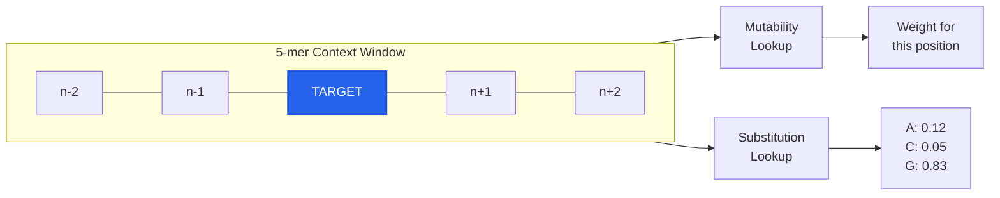
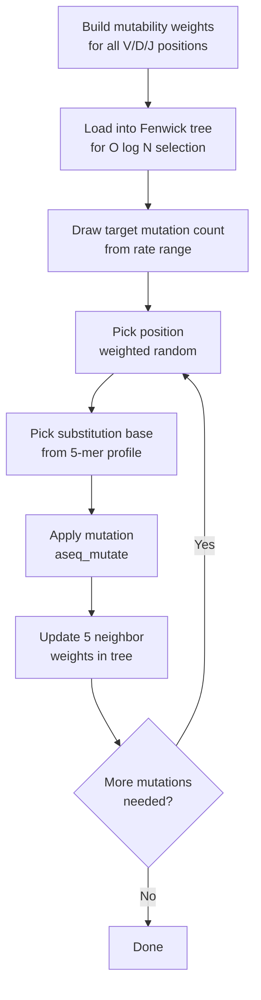
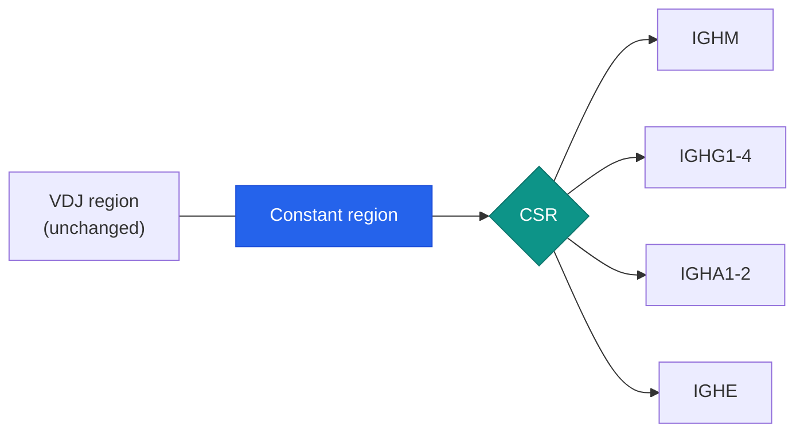
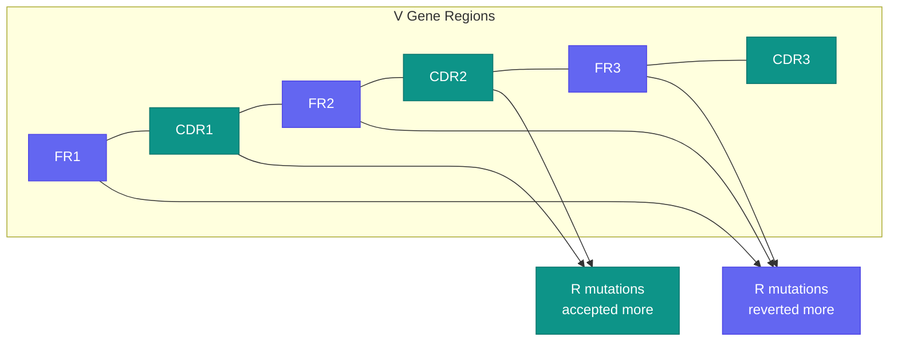

# Somatic Hypermutation

Somatic hypermutation (SHM) is the process by which B cells introduce point mutations into the variable regions of their immunoglobulin genes during an immune response. This is the primary mechanism behind antibody affinity maturation — cells with mutations that improve antigen binding are selectively expanded.

GenAIRR models SHM through the `.mutate()` phase, which supports mutation models, rate control, class switch recombination, and antigen selection pressure.

## Mutation rate

Use `rate(min, max)` to control the mutation rate. For each simulated sequence, GenAIRR draws a target rate uniformly from the specified range and introduces that proportion of mutations across the V, D, and J gene segments:

```python
from GenAIRR import Experiment
from GenAIRR.ops import rate

# Each sequence gets a mutation rate between 2% and 8%
result = Experiment.on("human_igh").mutate(rate(0.02, 0.08)).run(n=1000, seed=42)

rec = result[0]
print(rec["mutation_rate"])  # e.g. 0.054 (actual rate achieved)
print(rec["n_mutations"])    # e.g. 19
print(rec["mutations"])      # e.g. "51:c>T,57:c>G,81:a>T,..."
```

The actual mutation rate may differ slightly from the target because mutations are applied as discrete events on a finite-length sequence. N/P regions (non-templated nucleotides between gene segments) are not mutated — only positions originating from V, D, or J germline segments are eligible.

To generate sequences at a fixed rate, pass the same value for both min and max:

```python
# Exactly 5% mutation rate (as close as discrete mutation allows)
result = Experiment.on("human_igh").mutate(rate(0.05, 0.05)).run(n=100, seed=42)
```

## The mutation string

The `mutations` field records every mutation as a comma-separated list of `position:germline>mutant` entries:

```
51:c>T,57:c>G,81:a>T,99:a>G
```

- **Position** is 0-based into the `sequence` string
- **Germline base** is lowercase (what the base was before mutation)
- **Mutant base** is uppercase (what it was changed to)

This format lets you reconstruct the pre-mutation sequence or analyze mutation patterns programmatically.

## The S5F mutation model

GenAIRR uses the **S5F** (Somatic 5-mer Frequency) model by default. This is a context-dependent mutation model where each position's probability of being mutated depends on its surrounding 5-nucleotide context (2 bases upstream + the target + 2 bases downstream).



The model uses two lookup tables:
- **Mutability table** — for each 5-mer context, the relative probability of being targeted for mutation
- **Substitution table** — for each 5-mer context, the probability distribution over the three possible substitution bases

This captures the known biology that AID (activation-induced cytidine deaminase) targets specific sequence motifs — particularly **WRC hotspots** (W=A/T, R=A/G, C=target) and **SYC cold spots** (S=G/C, Y=C/T).

### How S5F works internally



The S5F data is derived from empirical mutation frequency tables and is loaded from the DataConfig at simulation time. The C engine uses a Fenwick tree for efficient O(log N) weighted random position selection, making S5F mutation fast even on long sequences.

```python
from GenAIRR.ops import model, rate

result = (
    Experiment.on("human_igh")
    .mutate(
        model("s5f"),
        rate(0.02, 0.08),
    )
    .run(n=1000, seed=42)
)
```

If no `model()` is specified, GenAIRR defaults to S5F.

## Germline alignment

The `germline_alignment` field shows the relationship between the final sequence and the original germline at each position:

<div className="seq-vis">
  <div><span className="sv-label">sequence</span><span className="sv-v">gaggtgcag</span><span className="sv-mut">T</span><span className="sv-v">tggtggagt</span><span className="sv-v">ctgggagga</span><span className="sv-v">...</span></div>
  <div><span className="sv-label">germline_alignment</span><span className="sv-v">gaggtgcag</span><span className="sv-v">c</span><span className="sv-v">tggtggagt</span><span className="sv-v">ctgggagga</span><span className="sv-v">...</span></div>
  <div><span className="sv-label"></span><span style={{opacity:0.5}}>         ↑ position 9: germline c mutated to T</span></div>
</div>

The encoding:
- **Lowercase** letter — unmutated position (germline base matches sequence)
- **Uppercase** letter in `sequence` — the mutated base; the corresponding position in `germline_alignment` shows the original germline base (lowercase)
- **`N`** in germline alignment — non-templated nucleotide (NP region, no germline origin)

<div className="seq-vis">
  <div><span className="sv-label">sequence</span><span className="sv-v">...agc</span><span className="sv-mut">T</span><span className="sv-v">gt</span><span className="sv-np">CCGTA</span><span className="sv-d">gtat</span><span className="sv-np">TACCG</span><span className="sv-j">actactgg...</span></div>
  <div><span className="sv-label">germline_alignment</span><span className="sv-v">...agc</span><span className="sv-v">c</span><span className="sv-v">gt</span><span className="sv-n">NNNNN</span><span className="sv-d">gtat</span><span className="sv-n">NNNNN</span><span className="sv-j">actactgg...</span></div>
  <div><span className="sv-label"></span><span style={{opacity:0.5}}>            ↑ SHM          ↑ NP1 (no germline)       ↑ NP2</span></div>
</div>

## Class switch recombination

Class switch recombination (CSR) is the process by which a B cell changes the constant region of its antibody, switching from IgM to IgG, IgA, or IgE. This changes the effector function of the antibody without altering its antigen specificity.



Add `with_isotype_rates()` to simulate CSR. GenAIRR assigns each sequence an isotype based on empirical class switching rates:

```python
from GenAIRR.ops import rate, with_isotype_rates

result = (
    Experiment.on("human_igh")
    .mutate(
        rate(0.02, 0.05),
        with_isotype_rates(),
    )
    .run(n=1000, seed=42)
)

# The c_call field contains the constant region allele
print(result[0]["c_call"])  # e.g. "IGHG3*17"
```

The isotype distribution reflects biological switching frequencies. For human IGH, you'll see a mix of IgM, IgG subtypes (IgG1-4), IgA subtypes (IgA1-2), IgD, and IgE, with IgG being the most common post-switch isotype.

CSR is only meaningful for IGH chains — it does not apply to light chains or TCR chains.

## Antigen selection pressure

In a real immune response, B cells compete for antigen binding. Cells whose mutations improve binding survive and proliferate; cells with detrimental mutations are eliminated. This creates a characteristic pattern: CDR regions (which contact the antigen) tolerate more replacement mutations, while framework regions (which maintain structural integrity) are under purifying selection.



GenAIRR models this by classifying each mutation after SHM as **replacement** (R, changes the amino acid) or **silent** (S, synonymous). Silent mutations are always kept. Replacement mutations are accepted or reverted based on their location:

- **CDR positions** — replacement mutations are accepted with higher probability (they may improve binding)
- **Framework positions** — replacement mutations are accepted with lower probability (they risk disrupting the fold)

Reverted mutations restore the original germline base, as if that B cell lineage was eliminated by selection.

```python
from GenAIRR.ops import rate, model, with_antigen_selection

result = (
    Experiment.on("human_igh")
    .mutate(
        model("s5f"),
        rate(0.02, 0.05),
        with_antigen_selection(0.5),
    )
    .run(n=1000, seed=42)
)
```

### Parameters

| Parameter | Default | Description |
|-----------|---------|-------------|
| `strength` | 0.5 | How strongly selection acts (0.0 = none, 1.0 = maximum) |
| `cdr_r_acceptance` | 0.85 | Base probability of accepting a replacement mutation in CDR regions |
| `fwr_r_acceptance` | 0.40 | Base probability of accepting a replacement mutation in framework regions |

### Effective acceptance probability

The effective acceptance probability is:

```
effective = 1.0 - strength * (1.0 - base_acceptance)
```

<div className="callout-card">
  <div className="cc-title">How strength scales acceptance</div>
  <div className="cc-body">
    <table>
      <thead><tr><th>Strength</th><th>CDR R acceptance</th><th>FWR R acceptance</th><th>Effect</th></tr></thead>
      <tbody>
        <tr><td><code>0.0</code></td><td>1.00</td><td>1.00</td><td>No selection — all replacements kept</td></tr>
        <tr><td><code>0.5</code></td><td>0.925</td><td>0.70</td><td>Moderate selection</td></tr>
        <tr><td><code>1.0</code></td><td>0.85</td><td>0.40</td><td>Full selection — strong FWR purification</td></tr>
      </tbody>
    </table>
  </div>
</div>

Region boundaries follow the IMGT numbering system:

<div className="seq-vis">
  <div>
    <span className="sv-label">IMGT regions</span>
    <span style={{background:'rgba(99,102,241,0.15)',padding:'0.15rem 0.4rem',borderRadius:'3px',color:'#6366f1',fontWeight:600,fontSize:'0.8rem'}}>FR1 0-77</span>
    <span style={{background:'rgba(13,148,136,0.15)',padding:'0.15rem 0.4rem',borderRadius:'3px',color:'#0d9488',fontWeight:600,fontSize:'0.8rem'}}>CDR1 78-113</span>
    <span style={{background:'rgba(99,102,241,0.15)',padding:'0.15rem 0.4rem',borderRadius:'3px',color:'#6366f1',fontWeight:600,fontSize:'0.8rem'}}>FR2 114-164</span>
    <span style={{background:'rgba(13,148,136,0.15)',padding:'0.15rem 0.4rem',borderRadius:'3px',color:'#0d9488',fontWeight:600,fontSize:'0.8rem'}}>CDR2 165-194</span>
    <span style={{background:'rgba(99,102,241,0.15)',padding:'0.15rem 0.4rem',borderRadius:'3px',color:'#6366f1',fontWeight:600,fontSize:'0.8rem'}}>FR3 195-311</span>
    <span style={{background:'rgba(13,148,136,0.15)',padding:'0.15rem 0.4rem',borderRadius:'3px',color:'#0d9488',fontWeight:600,fontSize:'0.8rem'}}>CDR3/FR4 312+</span>
  </div>
</div>

```python
# Strong selection — most FWR replacements will be reverted
result = (
    Experiment.on("human_igh")
    .mutate(
        model("s5f"),
        rate(0.03, 0.06),
        with_antigen_selection(
            strength=0.9,
            cdr_r_acceptance=0.9,
            fwr_r_acceptance=0.3,
        ),
    )
    .run(n=1000, seed=42)
)
```

## Combining all mutate ops

All `.mutate()` ops can be combined freely:

```python
from GenAIRR import Experiment
from GenAIRR.ops import rate, model, with_isotype_rates, with_antigen_selection

result = (
    Experiment.on("human_igh")
    .mutate(
        model("s5f"),
        rate(0.01, 0.05),
        with_isotype_rates(),
        with_antigen_selection(0.5),
    )
    .run(n=1000, seed=42)
)
```

This produces sequences with context-aware S5F mutations, realistic isotype distribution, and selection-shaped mutation patterns — closely approximating what you'd observe in post-germinal-center B cells.

## Output fields

| Field | Type | Example | Description |
|-------|------|---------|-------------|
| `mutation_rate` | float | `0.054` | Fraction of mutable positions that were mutated |
| `n_mutations` | int | `19` | Total point mutations applied |
| `mutations` | str | `"51:c>T,57:c>G,..."` | Position-by-position mutation record |
| `c_call` | str | `"IGHG3*17"` | Constant region allele (when CSR is enabled) |
