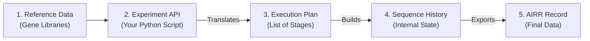

# GenAIRR Documentation

**GenAIRR** is a high-performance simulator for adaptive immune receptor sequences — the **B-cell Receptors (BCR)** and **T-cell Receptors (TCR)** that make up your immune system.

It produces synthetic sequences in the industry-standard **AIRR format**. Because the simulator builds every sequence from scratch, it provides **absolute ground-truth annotations**. This means you know the exact "answer" for every sequence: which gene segments were used, where every mutation is located, and exactly how much was trimmed from the ends.

```python
import GenAIRR as ga

# Generate 1,000 human heavy-chain sequences via standard V(D)J recombination.
outcomes = ga.Experiment.on("human_igh").recombine().run(n=1000, seed=42)
```

## Why GenAIRR?

GenAIRR is designed for researchers who need high-quality synthetic data to train machine learning models or test analysis tools.

*   **Absolute Ground Truth** — Most tools try to "guess" (infer) how a sequence was made. GenAIRR *knows* because it is the creator. This makes it the perfect gold standard for benchmarking.
*   **Biologically Valid** — Through its unique **Contract System**, GenAIRR ensures every sequence it builds is functional and realistic from the very first step, rather than generating random noise and filtering it later.
*   **Consistent Results** — GenAIRR is bit-for-bit identical across **Linux**, **macOS**, and **Windows**. The same "seed" number will always produce the exact same sequences, no matter what computer you use.
*   **High Performance** — Built with a high-speed Rust kernel, GenAIRR can produce tens of thousands of sequences per second. You can generate a repertoire of millions of sequences in just a few minutes.

## How it Works: The Simulation Lifecycle

GenAIRR works by taking biological reference data and passing it through a series of "stages" to build a final sequence:



## Where to start

import Link from '@docusaurus/Link';

<div style={{display: 'grid', gridTemplateColumns: 'repeat(auto-fit, minmax(280px, 1fr))', gap: '1rem', margin: '1.5rem 0'}}>

<div style={{border: '1px solid var(--ifm-color-emphasis-300)', borderRadius: '8px', padding: '1.25rem'}}>

### Quick Start

Install GenAIRR, run your first simulation, and see the results.

<Link to="/docs/getting-started/quick-start">Get started →</Link>

</div>

<div style={{border: '1px solid var(--ifm-color-emphasis-300)', borderRadius: '8px', padding: '1.25rem'}}>

### Choosing a Config

Learn how to pick the right species (Human, Mouse, etc.) and receptor type for your study.

<Link to="/docs/getting-started/choosing-config">Choose a config →</Link>

</div>

<div style={{border: '1px solid var(--ifm-color-emphasis-300)', borderRadius: '8px', padding: '1.25rem'}}>

### Understanding Output

Learn what each of the ~70 data fields means and how to read the results.

<Link to="/docs/getting-started/interpreting-results">Read the guide →</Link>

</div>

</div>

## The Experiment DSL

GenAIRR uses a "fluent" builder called `Experiment`. Think of it as a recipe where you chain together the biological and technical steps you want to simulate:

```python
import GenAIRR as ga

result = (
    ga.Experiment.on("human_igh")
    
    # 1. Biological V(D)J recombination (joining the gene segments)
    .recombine()

    # 2. Somatic hypermutation (adding biological mutations)
    .mutate(model="s5f", count=(5, 25))

    # 3. Sequencing artifacts (simulating data loss at the ends)
    .corrupt_5prime_loss(length=(5, 30))
    .corrupt_3prime_loss(length=(5, 20))

    # 4. Technical noise (adding random errors and 'N' bases)
    .corrupt_indels(prob=0.01)
    .corrupt_ns(prob=0.005)

    .run(n=1000, seed=42)
)
```

Each method adds a "pass" to the simulation. You only include the steps you need — for example, if you just want clean, unmutated sequences, you only need `.recombine()`.

## Site map

| Section | What you'll find |
|---------|-----------------|
| [**Start Here**](/docs/getting-started/quick-start) | Installation, first simulation, output interpretation |
| [**Guides**](/docs/guides/) | Recipes for common tasks — SHM, artifacts, export, workflows |
| [**Concepts**](/docs/concepts/) | Deep dives into how the engine works internally |
| [**Reference**](/docs/reference/) | Full catalog of all Python methods and parameters |
| [**Help**](/docs/help/) | FAQ and troubleshooting |
