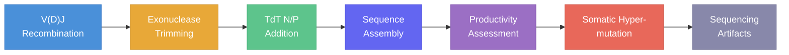

# Sequence Narration

GenAIRR can tell you the **story** of how a sequence was built — every allele choice, every trim, every mutation — as a human-readable narrative. Two functions, two modes:

| Function | Input | How It Works |
|----------|-------|-------------|
| `narrate(experiment)` | An `Experiment` (before `.run()`) | Hooks into the **live C engine trace** — records every internal decision as it happens |
| `narrate_from_record(record)` | A finished AIRR `dict` | **Reconstructs** the story from the final AIRR fields |

## Live Trace: `narrate()`

This is the most detailed mode. It instruments the C simulation engine and captures every internal step:

```python
from GenAIRR import Experiment, narrate
from GenAIRR.ops import rate, model

exp = Experiment.on("human_igh").mutate(rate(0.05, 0.10), model("s5f"))
print(narrate(exp, seed=42))
```

<details>
<summary><strong>Example output</strong> (click to expand)</summary>

```
══════════════════════════════════════════════════════════════════════
  GENAIRR EXECUTION TRACE  —  Live simulation narrative
══════════════════════════════════════════════════════════════════════

────────────────────────────────────────────────────────────
  Simulation Start
────────────────────────────────────────────────────────────
  ✓ simulate_one: chain=0, s5f=yes, csr=no, productive=no

────────────────────────────────────────────────────────────
  Allele Selection
────────────────────────────────────────────────────────────
  ▸ IGHVF10-G50*04 (len=296, anchor=285, pool=198, locked=no)
  ▸ IGHD2-21*02 (len=28, pool=33, locked=no)
  ▸ IGHJ4*02 (len=48, anchor=14, pool=7, locked=no)
  ▸ IGHE*04 (pool=86)

────────────────────────────────────────────────────────────
  Exonuclease Trimming
────────────────────────────────────────────────────────────
  ✂ 5'=0, 3'=0 (max_3'=10, allele_len=296, anchor=285)
  ✂ 5'=3, 3'=9 (d_len=28, remaining=16)
  ✂ 5'=9, 3'=0 (max_5'=13, allele_len=48, anchor=14)

────────────────────────────────────────────────────────────
  Sequence Assembly
────────────────────────────────────────────────────────────
  ▪ V: 296bp (germline[0:296], anchor_at=285)
  ▪ NP1: 9bp (TGTCAAGAA)
  ▪ D: 16bp (germline[3:19])
  ▪ NP2: 5bp (TTACC)
  ▪ J: 39bp (germline[9:48], anchor_at=14)
  total: 365bp = V(296) + NP1(9) + D(16) + NP2(5) + J(39)

────────────────────────────────────────────────────────────
  Productivity Assessment
────────────────────────────────────────────────────────────
  ▪ junction: [285:334] = 49bp
  ▪ vj_in_frame=no, stop_codon=yes, productive=no

────────────────────────────────────────────────────────────
  Somatic Hypermutation (S5F)
────────────────────────────────────────────────────────────
  ▪ target_rate=0.0798, target_n=29
  ↻ mutate pos=51 C→T (context=AGCAC, rate=0.009172)
  ↻ mutate pos=57 C→G (context=CTCAC, rate=0.004371)
  ↻ mutate pos=81 A→T (context=TCAAG, rate=0.002041)
  ...

══════════════════════════════════════════════════════════════════════
  Result: 365bp, 28 mutations, NON-PRODUCTIVE
══════════════════════════════════════════════════════════════════════
```

</details>

### API

```python
narrate(experiment, *, seed=42, color=True)
```

| Parameter | Type | Description |
|-----------|------|-------------|
| `experiment` | `Experiment` | An Experiment instance (before calling `.run()`) |
| `seed` | `int` | Random seed for reproducibility (default `42`) |
| `color` | `bool` | Use ANSI color codes for terminal output (default `True`) |

**Returns:** `str` — the full formatted trace.

:::tip Terminal Colors
Set `color=False` when writing to files or non-terminal output. The default (`True`) uses ANSI escape codes for colored output in terminals and notebooks.
:::

## Record Narration: `narrate_from_record()`

When you already have a simulated record and want to understand it, use `narrate_from_record`. It reconstructs the full biological story from the AIRR fields:

```python
from GenAIRR import Experiment, narrate_from_record
from GenAIRR.ops import rate, model

result = (
    Experiment.on("human_igh")
    .mutate(rate(0.05, 0.10), model("s5f"))
    .run(n=1, seed=42)
)

print(narrate_from_record(result[0]))
```

<details>
<summary><strong>Example output</strong> (click to expand)</summary>

```
────────────────────────────────────────────────────────────
  Phase 1: V(D)J Recombination
────────────────────────────────────────────────────────────
  • Selected V allele: IGHVF10-G50*04
  • Selected D allele: IGHD2-21*02
  • Selected J allele: IGHJ4*02
  • Selected C allele: IGHE*04 (isotype)

────────────────────────────────────────────────────────────
  Phase 2: Exonuclease Trimming
────────────────────────────────────────────────────────────
    V gene: no trimming
    D gene: trimmed 3bp from 5′ end
    D gene: trimmed 9bp from 3′ end
    D gene: 16bp remaining after trimming
    J gene: trimmed 9bp from 5′ end

────────────────────────────────────────────────────────────
  Phase 3: TdT N/P-Nucleotide Addition
────────────────────────────────────────────────────────────
    NP1 (V→D junction): inserted 9bp: TGTCAAGAA
    NP2 (D→J junction): inserted 5bp: TTACC

────────────────────────────────────────────────────────────
  Phase 4: Sequence Assembly
────────────────────────────────────────────────────────────
    Assembled: V(296bp) + NP1(9bp) + D(16bp) + NP2(5bp) + J(39bp)
    Total assembled length: 365bp
    Junction (CDR3): positions [285:334] = 49bp
      nt: tgtgcgagagaTGTCAAGAAataGtgtggtggtgacTTACCTctactgg
      aa: CARDVKK*CGGDLPLL

────────────────────────────────────────────────────────────
  Phase 5: Productivity Assessment
────────────────────────────────────────────────────────────
    VJ reading frame: OUT OF FRAME (junction 49bp mod 3 = 1)
    Conserved Cys (V anchor): PRESENT ('C')
    Conserved W/F (J anchor): MISSING ('L')
    Stop codon: FOUND (junction AA position 7)
    Verdict: NON-PRODUCTIVE — VJ out of frame.

────────────────────────────────────────────────────────────
  Phase 6: Somatic Hypermutation
────────────────────────────────────────────────────────────
    Applied 28 mutations (rate = 0.0798 = 7.98%)
      V region: 24 mutations
      D region: 1 mutations
      J region: 3 mutations
      Transitions: 13, Transversions: 15 (Ti/Tv = 0.9)
    pos  51 (V  ): c → T
    pos  57 (V  ): c → G
    pos  81 (V  ): a → T
    ...

────────────────────────────────────────────────────────────
  Phase 7: Sequencing Artifacts
────────────────────────────────────────────────────────────
    No sequencing artifacts

============================================================
  Final: 365bp, 28 mutations, NON-PRODUCTIVE
============================================================
```

</details>

### API

```python
narrate_from_record(record, *, color=True)
```

| Parameter | Type | Description |
|-----------|------|-------------|
| `record` | `dict` | An AIRR record dict (from `result[0]`, `stream().get()`, etc.) |
| `color` | `bool` | Use ANSI color codes (default `True`) |

**Returns:** `str` — the full formatted narrative.

## The Seven Phases

Both narration modes walk through the same biological phases:



| Phase | What it covers |
|-------|---------------|
| **1. V(D)J Recombination** | Which V, D, J (and C) alleles were selected |
| **2. Exonuclease Trimming** | How many bp were trimmed from each gene end |
| **3. TdT N/P Addition** | P-nucleotides and random N-additions at junctions |
| **4. Sequence Assembly** | Final assembled length, segment positions, junction coordinates |
| **5. Productivity Assessment** | Reading frame, conserved anchors, stop codons, verdict |
| **6. Somatic Hypermutation** | Number of mutations, rate, per-region breakdown, Ti/Tv ratio, individual mutations |
| **7. Sequencing Artifacts** | PCR errors, sequencing errors, reverse complement, contaminants |

## `narrate` vs `narrate_from_record`

| | `narrate` | `narrate_from_record` |
|---|-----------|----------------------|
| **Input** | `Experiment` object | AIRR record `dict` |
| **Data source** | Live C engine trace log | Reconstructed from AIRR fields |
| **Detail level** | Highest — includes internal engine decisions (pool sizes, context motifs, rates per position) | High — all biological phases but without engine internals |
| **Use case** | Debugging, understanding engine behavior | Quick inspection of any record |
| **Runs simulation** | Yes (1 sequence) | No |

## Combining with Visualization

Use both narration and visualization together for the full picture:

```python
from GenAIRR import Experiment, narrate, visualize_sequence
from GenAIRR.ops import rate, model

exp = Experiment.on("human_igh").mutate(rate(0.05, 0.10), model("s5f"))

# Live trace to terminal
print(narrate(exp, seed=42))

# Run and visualize
result = exp.run(n=1, seed=42)
visualize_sequence(result[0], "sequence.html")
```

The narration tells you **why**; the visualization shows you **what**.
